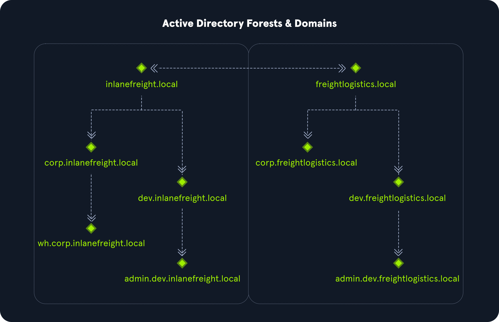
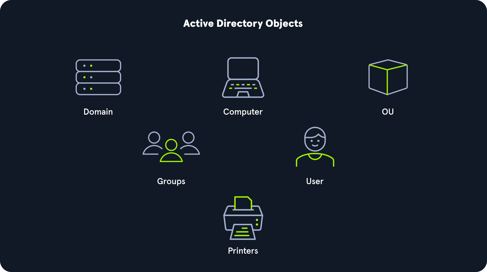
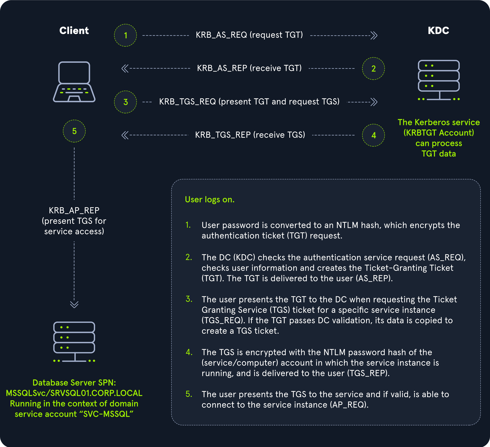
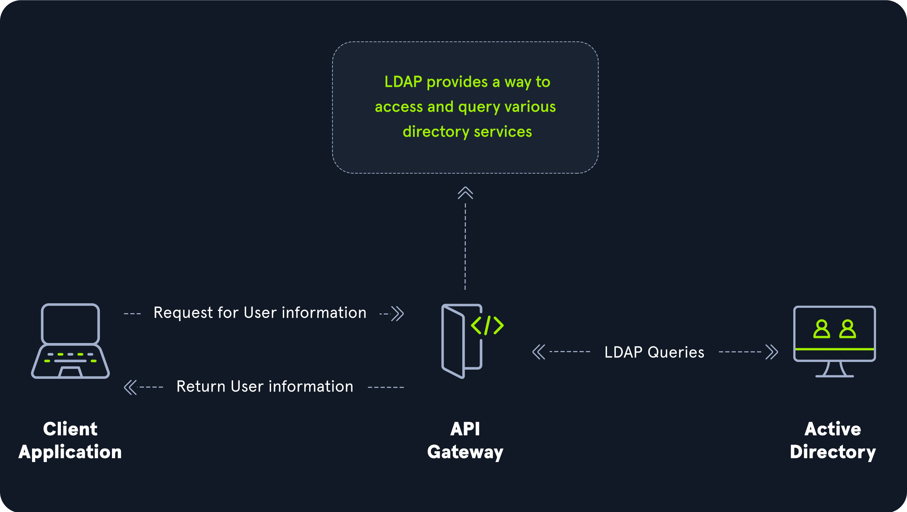
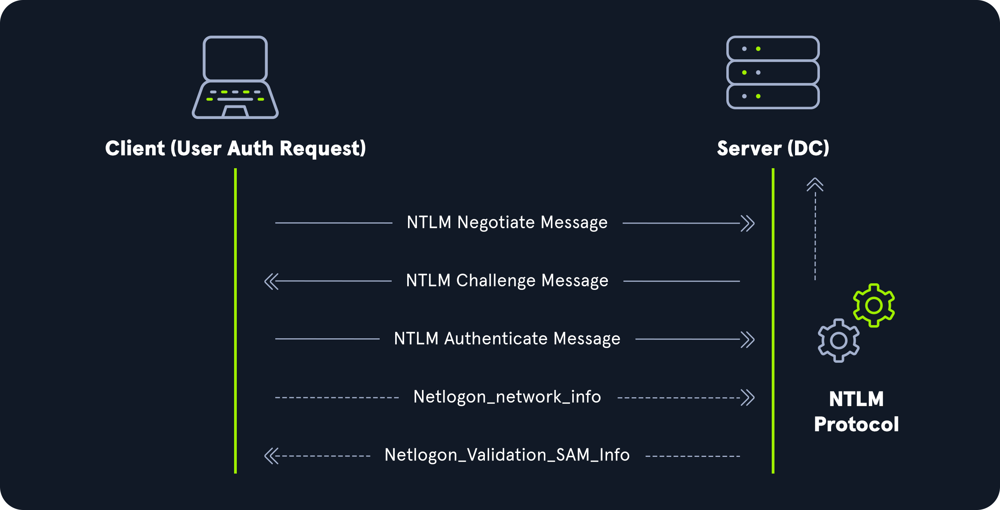
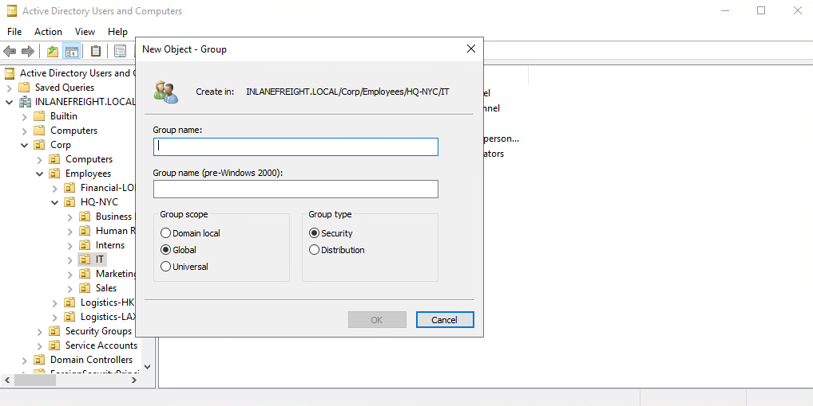
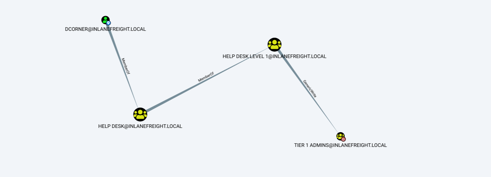
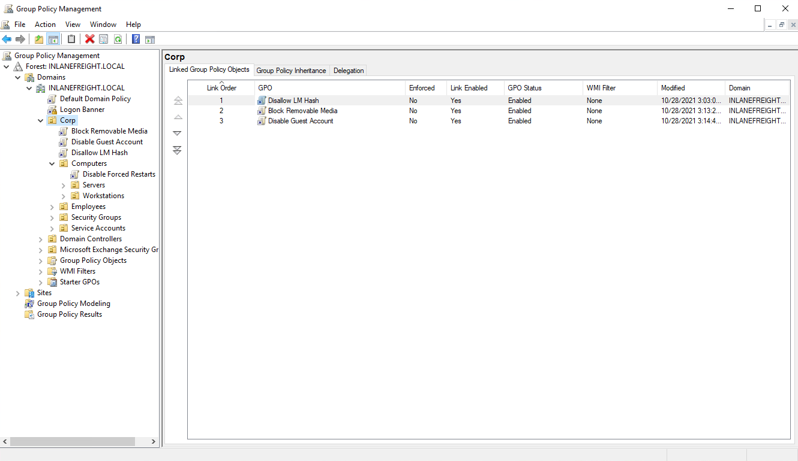
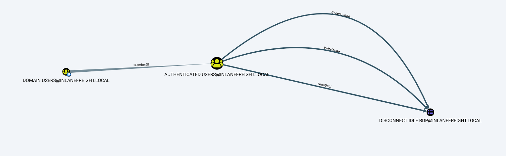

# Active Directory Basics

This notes are based on **INTRODUCTION TO ACTIVE DIRECTORY** on [HTB Academy](https://academy.hackthebox.com/module/74).

AD is a distributed, hierarchical structure that allows for centralized management of an organization's resources, including users, computers, groups, network devices, file shares, group policies, devices, and trusts.

A basic AD user account with no added privileges can enumerate most objects within AD.

It is estimated that around 95% of Fortune 500 companies run Active Directory, making AD a key focus for attackers.

LDAP is the foundation of Active Directory.

LDAP (Lightweight Directory Access Protocol) is an application protocol that defines how clients access directory services.

* Directory: A directory in this context is like a specialized database optimized for reading, searching, and browsing (not heavy write operations).

* Hierarchical: The data is stored in a tree-like structure (like a filesystem or organization chart).

* Usage: It's commonly used for storing user information (usernames, passwords, email addresses, group memberships, etc.), authentication, and authorization.

Active Directory (AD) is Microsoft’s implementation of a directory service. It:

*  Uses LDAP (and other protocols like Kerberos, DNS) as part of its core.

*  Is used to manage permissions, users, computers, and other resources in a Windows domain network.
 
*  Provides services like authentication, group policy management, user and group management, etc.

Active Directory uses LDAP as its primary protocol for directory access. That means that, when a client queries AD to find a user or validate a login, it's often using LDAP under the hood.

## AD Structure

A basic AD user account with no added privileges can be used to enumerate the majority of objects contained within AD, including but not limited to:

... | ...
---------------- | ------------
Domain Computers | Domain Users
Domain Group Information | Organizational Units (OUs)
Default Domain Policy | Functional Domain Levels
Password Policy | Group Policy Objects (GPOs)
Domain Trusts | Access Control Lists (ACLs)

Active Directory is arranged in a hierarchical tree structure, with a forest at the top containing one or more domains, which can themselves have nested subdomains. A forest is the security boundary within which all objects are under administrative control. A forest may contain multiple domains, and a domain may include further child or sub-domains. A domain is a structure within which contained objects (users, computers, and groups) are accessible.

```txt
INLANEFREIGHT.LOCAL/
├── ADMIN.INLANEFREIGHT.LOCAL
│   ├── GPOs
│   └── OU
│       └── EMPLOYEES
│           ├── COMPUTERS
│           │   └── FILE01
│           ├── GROUPS
│           │   └── HQ Staff
│           └── USERS
│               └── barbara.jones
├── CORP.INLANEFREIGHT.LOCAL
└── DEV.INLANEFREIGHT.LOCAL
```

Here we could say that INLANEFREIGHT.LOCAL is the root domain and contains the subdomains (either child or tree root domains) ADMIN.INLANEFREIGHT.LOCAL, CORP.INLANEFREIGHT.LOCAL, and DEV.INLANEFREIGHT.LOCAL as well as the other objects that make up a domain such as users, groups, computers.

It is common to see multiple domains (or forests) linked together via trust relationships in organizations that perform a lot of acquisitions. Domain trusts can introduce a slew of security issues if not appropriately administered.

The graphic below shows two forests, `INLANEFREIGHT.LOCAL` and `FREIGHTLOGISTICS.LOCAL`. The two-way arrow represents a bidirectional trust between the two forests, meaning that users in `INLANEFREIGHT.LOCAL` can access resources in `FREIGHTLOGISTICS.LOCAL` and vice versa.

A user that is part of `admin.dev.freightlogistics.local` would NOT be able to authenticate to machines in the `wh.corp.inlanefreight.local` domain by default even though a bidirectional trust exists between the top-level `inlanefreight.local` and `freightlogistics.local` domains. To allow direct communication from `admin.dev.freightlogistics.local` and `wh.corp.inlanefreight.local`, another trust would need to be set up.




## AD Terminology

#### Object

An object can be defined as ANY resource present within an Active Directory environment such as OUs, printers, users, domain controllers, etc.

#### Attributes

Every object in Active Directory has an associated set of attributes used to define characteristics of the given object. A computer object contains attributes such as the hostname and DNS name. All attributes in AD have an associated LDAP name that can be used when performing LDAP queries, such as `displayName` for Full Name and ` given name` for First Name.

#### Schema

The Active Directory schema is essentially the blueprint of any enterprise environment. It defines what types of objects can exist in the AD database and their associated attributes. It lists definitions corresponding to AD objects and holds information about each object. For example, users in AD belong to the class "user," and computer objects to "computer," and so on. Each object has its own information (some required to be set and others optional) that are stored in Attributes.

#### Domain

A domain is a logical group of objects such as computers, users, OUs, groups, etc. We can think of each domain as a different city within a state or country. Domains can operate entirely independently of one another or be connected via trust relationships.

#### Forest

A forest is a collection of Active Directory domains. It is the topmost container and contains all of the AD objects introduced below, including but not limited to domains, users, groups, computers, and Group Policy objects. A forest can contain one or multiple domains and be thought of as a state in the US or a country within the EU. Each forest operates independently but may have various trust relationships with other forests.

#### Tree

A tree is a collection of Active Directory domains that begins at a single root domain. A forest is a collection of AD trees. Each domain in a tree shares a boundary with the other domains. A parent-child trust relationship is formed when a domain is added under another domain in a tree. Two trees in the same forest cannot share a name (namespace). Let's say we have two trees in an AD forest: `inlanefreight.local` and `ilfreight.local`. A child domain of the first would be `corp.inlanefreight.local` while a child domain of the second could be `corp.ilfreight.local`. All domains in a tree share a standard Global Catalog which contains all information about objects that belong to the tree.

#### Container

Container objects hold other objects and have a defined place in the directory subtree hierarchy.

#### Leaf

Leaf objects do not contain other objects and are found at the end of the subtree hierarchy.

#### Global Unique Identifier (GUID)

A GUID is a unique 128-bit value assigned when a domain user or group is created. This GUID value is unique across the enterprise, similar to a MAC address. Every single object created by Active Directory is assigned a GUID, not only user and group objects. The GUID is stored in the `ObjectGUID` attribute. When querying for an AD object (such as a user, group, computer, domain, domain controller, etc.), we can query for its `ObjectGUID` value using PowerShell or search for it by specifying its distinguished name, GUID, SID, or SAM account name.

#### Security principals

Security principals are anything that the operating system can authenticate, including users, computer accounts, or even threads/processes that run in the context of a user or computer account (i.e., an application such as Tomcat running in the context of a service account within the domain). In AD, security principles are domain objects that can manage access to other resources within the domain. We can also have local user accounts and security groups used to control access to resources on only that specific computer. These are not managed by AD but rather by the Security Accounts Manager (SAM).

#### Security Identifier (SID)

A security identifier, or SID is used as a unique identifier for a security principal or security group. Every account, group, or process has its own unique SID, which, in an AD environment, is issued by the domain controller and stored in a secure database. A SID can only be used once. Even if the security principle is deleted, it can never be used again in that environment to identify another user or group. When a user logs in, the system creates an access token for them which contains the user's SID, the rights they have been granted, and the SIDs for any groups that the user is a member of. This token is used to check rights whenever the user performs an action on the computer. There are also well-known SIDs that are used to identify generic users and groups. These are the same across all operating systems. An example is the `Everyone` group.

#### Distinguished Name (DN)

A Distinguished Name (DN) describes the full path to an object in AD (such as `cn=bjones, ou=IT, ou=Employees, dc=inlanefreight, dc=local`). In this example, the user `bjones` works in the IT department of the company Inlanefreight, and his account is created in an Organizational Unit (OU) that holds accounts for company employees. The Common Name (CN) `bjones` is just one way the user object could be searched for or accessed within the domain.

#### Relative Distinguished Name (RDN)

A Relative Distinguished Name (RDN) is a single component of the Distinguished Name that identifies the object as unique from other objects at the current level in the naming hierarchy. In our example, bjones is the Relative Distinguished Name of the object. AD does not allow two objects with the same name under the same parent container, but there can be two objects with the same RDNs that are still unique in the domain because they have different DNs. For example, the object `cn=bjones,dc=dev,dc=inlanefreight,dc=local` would be recognized as different from `cn=bjones,dc=inlanefreight,dc=local`.

#### sAMAccountName

The `sAMAccountName` is the user's logon name. Here it would just be `bjones`. It must be a unique value and 20 or fewer characters.

#### userPrincipalName

The `userPrincipalName` attribute is another way to identify users in AD. This attribute consists of a prefix (the user account name) and a suffix (the domain name) in the format of `bjones@inlanefreight.local`. This attribute is not mandatory.

#### FSMO Roles

In the early days of AD, if you had multiple DCs in an environment, they would fight over which DC gets to make changes, and sometimes changes would not be made properly. Microsoft then implemented "last writer wins," which could introduce its own problems if the last change breaks things. They then introduced a model in which a single "master" DC could apply changes to the domain while the others merely fulfilled authentication requests. This was a flawed design because if the master DC went down, no changes could be made to the environment until it was restored. To resolve this single point of failure model, Microsoft separated the various responsibilities that a DC can have into Flexible Single Master Operation (FSMO) roles. These give Domain Controllers (DC) the ability to continue authenticating users and granting permissions without interruption (authorization and authentication). There are five FSMO roles: Schema Master and Domain Naming Master (one of each per forest), Relative ID (RID) Master (one per domain), Primary Domain Controller (PDC) Emulator (one per domain), and Infrastructure Master (one per domain). All five roles are assigned to the first DC in the forest root domain in a new AD forest. Each time a new domain is added to a forest, only the RID Master, PDC Emulator, and Infrastructure Master roles are assigned to the new domain. FSMO roles are typically set when domain controllers are created, but sysadmins can transfer these roles if needed. These roles help replication in AD to run smoothly and ensure that critical services are operating correctly. We will walk through each of these roles in detail later in this section.


#### Global Catalog

A global catalog (GC) is a domain controller that stores copies of ALL objects in an Active Directory forest. The GC stores a full copy of all objects in the current domain and a partial copy of objects that belong to other domains in the forest. Standard domain controllers hold a complete replica of objects belonging to its domain but not those of different domains in the forest. The GC allows both users and applications to find information about any objects in ANY domain in the forest. GC is a feature that is enabled on a domain controller and performs the following functions:

*  Authentication (provided authorization for all groups that a user account belongs to, which is included when an access token is generated)
*  Object search (making the directory structure within a forest transparent, allowing a search to be carried out across all domains in a forest by providing just one attribute about an object.)

#### Read-Only Domain Controller (RODC)

A Read-Only Domain Controller (RODC) has a read-only Active Directory database. No AD account passwords are cached on an RODC (other than the RODC computer account & RODC KRBTGT passwords.) No changes are pushed out via an RODC's AD database, SYSVOL, or DNS. RODCs also include a read-only DNS server, allow for administrator role separation, reduce replication traffic in the environment, and prevent SYSVOL modifications from being replicated to other DCs.

#### Replication

Replication happens in AD when AD objects are updated and transferred from one Domain Controller to another. Whenever a DC is added, connection objects are created to manage replication between them. These connections are made by the Knowledge Consistency Checker (KCC) service, which is present on all DCs. Replication ensures that changes are synchronized with all other DCs in a forest, helping to create a backup in case one domain controller fails.

#### Service Principal Name (SPN)

A Service Principal Name (SPN) uniquely identifies a service instance. They are used by Kerberos authentication to associate an instance of a service with a logon account, allowing a client application to request the service to authenticate an account without needing to know the account name.

#### Group Policy Object (GPO)

Group Policy Objects (GPOs) are virtual collections of policy settings. Each GPO has a unique GUID. A GPO can contain local file system settings or Active Directory settings. GPO settings can be applied to both user and computer objects. They can be applied to all users and computers within the domain or defined more granularly at the OU level.

#### Access Control List (ACL)

An Access Control List (ACL) is the ordered collection of Access Control Entries (ACEs) that apply to an object.

#### Access Control Entries (ACEs)

Each Access Control Entry (ACE) in an ACL identifies a trustee (user account, group account, or logon session) and lists the access rights that are allowed, denied, or audited for the given trustee.

#### Discretionary Access Control List (DACL)

DACLs define which security principles are granted or denied access to an object; it contains a list of ACEs. When a process tries to access a securable object, the system checks the ACEs in the object's DACL to determine whether or not to grant access. If an object does NOT have a DACL, then the system will grant full access to everyone, but if the DACL has no ACE entries, the system will deny all access attempts. ACEs in the DACL are checked in sequence until a match is found that allows the requested rights or until access is denied.

#### System Access Control Lists (SACL)

Allows for administrators to log access attempts that are made to secured objects. ACEs specify the types of access attempts that cause the system to generate a record in the security event log.

#### Fully Qualified Domain Name (FQDN)

An FQDN is the complete name for a specific computer or host. It is written with the hostname and domain name in the format [host name].[domain name].[tld]. This is used to specify an object's location in the tree hierarchy of DNS. The FQDN can be used to locate hosts in an Active Directory without knowing the IP address, much like when browsing to a website such as google.com instead of typing in the associated IP address. An example would be the host `DC01` in the domain `INLANEFREIGHT.LOCAL`. The FQDN here would be `DC01.INLANEFREIGHT.LOCAL`.

#### Tombstone

A tombstone is a container object in AD that holds deleted AD objects. When an object is deleted from AD, the object remains for a set period of time known as the Tombstone Lifetime, and the isDeleted attribute is set to TRUE. Once an object exceeds the Tombstone Lifetime, it will be entirely removed. Microsoft recommends a tombstone lifetime of 180 days to increase the usefulness of backups, but this value may differ across environments. Depending on the DC operating system version, this value will default to 60 or 180 days. If an object is deleted in a domain that does not have an AD Recycle Bin, it will become a tombstone object. When this happens, the object is stripped of most of its attributes and placed in the Deleted Objects container for the duration of the `tombstoneLifetime`. It can be recovered, but any attributes that were lost can no longer be recovered.

#### AD Recycle Bin

The AD Recycle Bin was first introduced in Windows Server 2008 R2 to facilitate the recovery of deleted AD objects. This made it easier for sysadmins to restore objects, avoiding the need to restore from backups, restarting Active Directory Domain Services (AD DS), or rebooting a Domain Controller. When the AD Recycle Bin is enabled, any deleted objects are preserved for a period of time, facilitating restoration if needed. Sysadmins can set how long an object remains in a deleted, recoverable state. If this is not specified, the object will be restorable for a default value of 60 days. The biggest advantage of using the AD Recycle Bin is that most of a deleted object's attributes are preserved, which makes it far easier to fully restore a deleted object to its previous state.

#### SYSVOL

The SYSVOL folder, or share, stores copies of public files in the domain such as system policies, Group Policy settings, logon/logoff scripts, and often contains other types of scripts that are executed to perform various tasks in the AD environment. The contents of the SYSVOL folder are replicated to all DCs within the environment using File Replication Services (FRS).

#### AdminSDHolder

The `AdminSDHolder` object is used to manage ACLs for members of built-in groups in AD marked as privileged. It acts as a container that holds the Security Descriptor applied to members of protected groups. The SDProp (SD Propagator) process runs on a schedule on the PDC Emulator Domain Controller. When this process runs, it checks members of protected groups to ensure that the correct ACL is applied to them. It runs every hour by default. For example, suppose an attacker is able to create a malicious ACL entry to grant a user certain rights over a member of the Domain Admins group. In that case, unless they modify other settings in AD, these rights will be removed (and they will lose any persistence they were hoping to achieve) when the SDProp process runs on the set interval.

#### dsHeuristics

The `dsHeuristics` attribute is a string value set on the Directory Service object used to define multiple forest-wide configuration settings. One of these settings is to exclude built-in groups from the Protected Groups list. Groups in this list are protected from modification via the `AdminSDHolder` object. If a group is excluded via the `dsHeuristics` attribute, then any changes that affect it will not be reverted when the SDProp process runs.

#### adminCount

The `adminCount` attribute determines whether or not the SDProp process protects a user. If the value is set to 0 or not specified, the user is not protected. If the attribute value is set to 1, the user is protected. Attackers will often look for accounts with the `adminCount` attribute set to 1 to target in an internal environment. These are often privileged accounts and may lead to further access or full domain compromise.

#### Active Directory Users and Computers (ADUC)

ADUC is a GUI console commonly used for managing users, groups, computers, and contacts in AD. Changes made in ADUC can be done via PowerShell as well.

#### ADSI Edit

ADSI Edit is a GUI tool used to manage objects in AD. It provides access to far more than is available in ADUC and can be used to set or delete any attribute available on an object, add, remove, and move objects as well. It is a powerful tool that allows a user to access AD at a much deeper level. Great care should be taken when using this tool, as changes here could cause major problems in AD.

#### sIDHistory

This attribute holds any SIDs that an object was assigned previously. It is usually used in migrations so a user can maintain the same level of access when migrated from one domain to another. This attribute can potentially be abused if set insecurely, allowing an attacker to gain prior elevated access that an account had before a migration if SID Filtering (or removing SIDs from another domain from a user's access token that could be used for elevated access) is not enabled.

#### NTDS.DIT

The NTDS.DIT file can be considered the heart of Active Directory. It is stored on a Domain Controller at `C:\Windows\NTDS\` and is a database that stores AD data such as information about user and group objects, group membership, and, most important to attackers and penetration testers, the password hashes for all users in the domain. Once full domain compromise is reached, an attacker can retrieve this file, extract the hashes, and either use them to perform a pass-the-hash attack or crack them offline using a tool such as Hashcat to access additional resources in the domain. If the setting Store password with reversible encryption is enabled, then the NTDS.DIT will also store the cleartext passwords for all users created or who changed their password after this policy was set. While rare, some organizations may enable this setting if they use applications or protocols that need to use a user's existing password (and not Kerberos) for authentication.

#### MSBROWSE

MSBROWSE is a Microsoft networking protocol that was used in early versions of Windows-based local area networks (LANs) to provide browsing services. It was used to maintain a list of resources, such as shared printers and files, that were available on the network, and to allow users to easily browse and access these resources.

In older version of Windows we could use `nbtstat -A ip-address` to search for the Master Browser. If we see MSBROWSE it means that's the Master Browser. Aditionally we could use `nltest` utility to query a Windows Master Browser for the names of the Domain Controllers.

Today, MSBROWSE is largely obsolete and is no longer in widespread use. Modern Windows-based LANs use the Server Message Block (SMB) protocol for file and printer sharing, and the Common Internet File System (CIFS) protocol for browsing services.

## AD Objects

An object can be defined as ANY resource present within an Active Directory environment such as OUs, printers, users, domain controllers.



Here I will list only the non-trivial ones:

#### Groups

A group is considered a container object because it can contain other objects, including users, computers, and even other groups. A group IS regarded as a security principal and has a SID and a GUID. In AD, groups are a way to manage user permissions and access to other securable objects (both users and computers). Let's say we want to give 20 help desk users access to the Remote Management Users group on a jump host. Instead of adding the users one by one, we could add the group, and the users would inherit the intended permissions via their membership in the group. In Active Directory, we commonly see what are called "nested groups" (a group added as a member of another group), which can lead to a user(s) obtaining unintended rights. Nested group membership is something we see and often leverage during penetration tests. The tool `BloodHound` helps to discover attack paths within a network and illustrate them in a graphical interface. It is excellent for auditing group membership and uncovering/seeing the sometimes unintended impacts of nested group membership. Groups in AD can have many attributes, the most common being the name, description, membership, and other groups that the group belongs to. Many other attributes can be set, which we will discuss more in-depth later in this module.

#### Organizational Units (OUs)

An organizational unit, or OU from here on out, is a container that systems administrators can use to store similar objects for ease of administration. OUs are often used for administrative delegation of tasks without granting a user account full administrative rights. For example, we may have a top-level OU called Employees and then child OUs under it for the various departments such as Marketing, HR, Finance, Help Desk, etc. If an account were given the right to reset passwords over the top-level OU, this user would have the right to reset passwords for all users in the company. However, if the OU structure were such that specific departments were child OUs of the Help Desk OU, then any user placed in the Help Desk OU would have this right delegated to them if granted. Other tasks that may be delegated at the OU level include creating/deleting users, modifying group membership, managing Group Policy links, and performing password resets. OUs are very useful for managing Group Policy (which we will study later in this module) settings across a subset of users and groups within a domain. For example, we may want to set a specific password policy for privileged service accounts so these accounts could be placed in a particular OU and then have a Group Policy object assigned to it, which would enforce this password policy on all accounts placed inside of it. A few OU attributes include its name, members, security settings, and more.

#### Domain

A domain is the structure of an AD network. Domains contain objects such as users and computers, which are organized into container objects: groups and OUs. Every domain has its own separate database and sets of policies that can be applied to any and all objects within the domain. Some policies are set by default (and can be tweaked), such as the domain password policy. In contrast, others are created and applied based on the organization's need, such as blocking access to cmd.exe for all non-administrative users or mapping shared drives at log in.

#### Domain Controllers

Domain Controllers are essentially the brains of an AD network. They handle authentication requests, verify users on the network, and control who can access the various resources in the domain. All access requests are validated via the domain controller and privileged access requests are based on predetermined roles assigned to users. It also enforces security policies and stores information about every other object in the domain.

#### Sites

A site in AD is a set of computers across one or more subnets connected using high-speed links. They are used to make replication across domain controllers run efficiently.

#### Built-in

In AD, built-in is a container that holds default groups in an AD domain. They are predefined when an AD domain is created.

#### Foreign Security Principals

A foreign security principal (FSP) is an object created in AD to represent a security principal that belongs to a trusted external forest. They are created when an object such as a user, group, or computer from an external (outside of the current) forest is added to a group in the current domain. They are created automatically after adding a security principal to a group. Every foreign security principal is a placeholder object that holds the SID of the foreign object (an object that belongs to another forest.) Windows uses this SID to resolve the object's name via the trust relationship. FSPs are created in a specific container named ForeignSecurityPrincipals with a distinguished name like `cn=ForeignSecurityPrincipals,dc=inlanefreight,dc=local`.


## AD Functionality

There are five Flexible Single Master Operation (FSMO) roles:

Roles | Description
----- | -----------
Schema Master | This role manages the read/write copy of the AD schema, which defines all attributes that can apply to an object in AD.
Domain Naming Master | Manages domain names and ensures that two domains of the same name are not created in the same forest.
Relative ID (RID) Master | The RID Master assigns blocks of RIDs to other DCs within the domain that can be used for new objects. The RID Master helps ensure that multiple objects are not assigned the same SID. Domain object SIDs are the domain SID combined with the RID number assigned to the object to make the unique SID.
PDC Emulator | The host with this role would be the authoritative DC in the domain and respond to authentication requests, password changes, and manage Group Policy Objects (GPOs). The PDC Emulator also maintains time within the domain.
Infrastructure Master | This role translates GUIDs, SIDs, and DNs between domains. This role is used in organizations with multiple domains in a single forest. The Infrastructure Master helps them to communicate. If this role is not functioning properly, Access Control Lists (ACLs) will show SIDs instead of fully resolved names.

### Trusts

Trust Type | Description
---------- | -----------
Parent-child | Domains within the same forest. The child domain has a two-way transitive trust with the parent domain.
Cross-link | a trust between child domains to speed up authentication.
External | A non-transitive trust between two separate domains in separate forests which are not already joined by a forest trust. This type of trust utilizes SID filtering.
Tree-root | a two-way transitive trust between a forest root domain and a new tree root domain. They are created by design when you set up a new tree root domain within a forest.
Forest | a transitive trust between two forest root domains.


Trusts can be transitive or non-transitive.

* A transitive trust means that trust is extended to objects that the child domain trusts.
* In a non-transitive trust, only the child domain itself is trusted.


Trusts can be set up to be one-way or two-way (bidirectional).

* In bidirectional trusts, users from both trusting domains can access resources.
* In a one-way trust, only users in a trusted domain can access resources in a trusting domain, not vice-versa. The direction of trust is opposite to the direction of access.


## AD Protocols

Active Directory specifically requires **Lightweight Directory Access Protocol (LDAP)**, Microsoft's version of **Kerberos**, **DNS** for authentication and communication, and **MSRPC** which is the Microsoft implementation of **Remote Procedure Call (RPC)**, an interprocess communication technique used for client-server model-based applications.

### Kerberos

Kerberos has been the default authentication protocol for domain accounts since Windows 2000. Kerberos is an open standard and allows for interoperability with other systems using the same standard. When a user logs into their PC, Kerberos is used to authenticate them via mutual authentication, or both the user and the server verify their identity. Kerberos is a stateless authentication protocol based on tickets instead of transmitting user passwords over the network. As part of Active Directory Domain Services (AD DS), Domain Controllers have a Kerberos Key Distribution Center (KDC) that issues tickets. When a user initiates a login request to a system, the client they are using to authenticate requests a ticket from the KDC, encrypting the request with the user's password. If the KDC can decrypt the request (AS-REQ) using their password, it will create a Ticket Granting Ticket (TGT) and transmit it to the user. The user then presents its TGT to a Domain Controller to request a Ticket Granting Service (TGS) ticket, encrypted with the associated service's NTLM password hash. Finally, the client requests access to the required service by presenting the TGS to the application or service, which decrypts it with its password hash. If the entire process completes appropriately, the user will be permitted to access the requested service or application.

Kerberos authentication effectively decouples users' credentials from their requests to consumable resources, ensuring that their password isn't transmitted over the network (i.e., accessing an internal SharePoint intranet site). The Kerberos Key Distribution Centre (KDC) does not record previous transactions. Instead, the Kerberos Ticket Granting Service ticket (TGS) relies on a valid Ticket Granting Ticket (TGT). It assumes that if the user has a valid TGT, they must have proven their identity. The following diagram walks through this process at a high level.

#### Kerberos Authentication Process

1. When a user logs in, their password is used to encrypt a timestamp, which is sent to the Key Distribution Center (KDC) to verify the integrity of the authentication by decrypting it. The KDC then issues a Ticket-Granting Ticket (TGT), encrypting it with the secret key of the krbtgt account. This TGT is used to request service tickets for accessing network resources, allowing authentication without repeatedly transmitting the user's credentials. This process decouples the user's credentials from requests to resources.
2. The KDC service on the DC checks the authentication service request (AS-REQ), verifies the user information, and creates a Ticket Granting Ticket (TGT), which is delivered to the user.
3. The user presents the TGT to the DC, requesting a Ticket Granting Service (TGS) ticket for a specific service. This is the TGS-REQ. If the TGT is successfully validated, its data is copied to create a TGS ticket.
4. The TGS is encrypted with the NTLM password hash of the service or computer account in whose context the service instance is running and is delivered to the user in the TGS_REP.
5. The user presents the TGS to the service, and if it is valid, the user is permitted to connect to the resource (AP_REQ).



The Kerberos protocol uses port 88 (both TCP and UDP). When enumerating an Active Directory environment, we can often locate Domain Controllers by performing port scans looking for open port 88 using a tool such as Nmap.

### DNS

Active Directory Domain Services (AD DS) uses DNS to allow clients (workstations, servers, and other systems that communicate with the domain) to locate Domain Controllers and for Domain Controllers that host the directory service to communicate amongst themselves. DNS is used to resolve hostnames to IP addresses and is broadly used across internal networks and the internet. Private internal networks use Active Directory DNS namespaces to facilitate communications between servers, clients, and peers. AD maintains a database of services running on the network in the form of service records (SRV). These service records allow clients in an AD environment to locate services that they need, such as a file server, printer, or Domain Controller. Dynamic DNS is used to make changes in the DNS database automatically should a system's IP address change. Making these entries manually would be very time-consuming and leave room for error. If the DNS database does not have the correct IP address for a host, clients will not be able to locate and communicate with it on the network. When a client joins the network, it locates the Domain Controller by sending a query to the DNS service, retrieving an SRV record from the DNS database, and transmitting the Domain Controller's hostname to the client. The client then uses this hostname to obtain the IP address of the Domain Controller. DNS uses TCP and UDP port 53. UDP port 53 is the default, but it falls back to TCP when no longer able to communicate and DNS messages are larger than 512 bytes.


#### Forward DNS Lookup

We can perform a `nslookup` for the domain name and retrieve all Domain Controllers' IP addresses in a domain.
```powershell
PS C:\htb> nslookup INLANEFREIGHT.LOCAL

Server:  172.16.6.5
Address:  172.16.6.5

Name:    INLANEFREIGHT.LOCAL
Address:  172.16.6.5
```

#### Reverse DNS Lookup

If we would like to obtain the DNS name of a single host using the IP address, we can do this as follows:
```powershell
PS C:\htb> nslookup 172.16.6.5

Server:  172.16.6.5
Address:  172.16.6.5

Name:    ACADEMY-EA-DC01.INLANEFREIGHT.LOCAL
Address:  172.16.6.5
```

#### Finding IP Address of a Host

If we would like to find the IP address of a single host, we can do this in reverse. We can do this with or without specifying the FQDN.
```powershell
PS C:\htb> nslookup "ACADEMY-EA-DC01"

Server:   172.16.6.5
Address:  172.16.6.5

Name:    ACADEMY-EA-DC01.INLANEFREIGHT.LOCAL
Address:  172.16.6.5
```

### LDAP

Active Directory supports Lightweight Directory Access Protocol (LDAP) for directory lookups. LDAP is an open-source and cross-platform protocol used for authentication against various directory services (such as AD). The latest LDAP specification is Version 3, published as RFC 4511. A firm understanding of how LDAP works in an AD environment is crucial for attackers and defenders. LDAP uses port 389, and LDAP over SSL (LDAPS) communicates over port 636.

AD stores user account information and security information such as passwords and facilitates sharing this information with other devices on the network. LDAP is the language that applications use to communicate with other servers that provide directory services. In other words, LDAP is how systems in the network environment can "speak" to AD.

An LDAP session begins by first connecting to an LDAP server, also known as a Directory System Agent. The Domain Controller in AD actively listens for LDAP requests, such as security authentication requests.



The relationship between AD and LDAP can be compared to Apache and HTTP. The same way Apache is a web server that uses the HTTP protocol, Active Directory is a directory server that uses the LDAP protocol.

#### AD LDAP Authentication

LDAP is set up to authenticate credentials against AD using a "BIND" operation to set the authentication state for an LDAP session. There are two types of LDAP authentication.

* Simple Authentication: This includes anonymous authentication, unauthenticated authentication, and username/password authentication. Simple authentication means that a username and password create a BIND request to authenticate to the LDAP server.

* SASL Authentication: The Simple Authentication and Security Layer (SASL) framework uses other authentication services, such as Kerberos, to bind to the LDAP server and then uses this authentication service (Kerberos in this example) to authenticate to LDAP. The LDAP server uses the LDAP protocol to send an LDAP message to the authorization service, which initiates a series of challenge/response messages resulting in either successful or unsuccessful authentication. SASL can provide additional security due to the separation of authentication methods from application protocols.

LDAP authentication messages are sent in cleartext by default so anyone can sniff out LDAP messages on the internal network. It is recommended to use TLS encryption or similar to safeguard this information in transit.

### MSRPC

As mentioned above, MSRPC is Microsoft's implementation of Remote Procedure Call (RPC), an interprocess communication technique used for client-server model-based applications. Windows systems use MSRPC to access systems in Active Directory using four key RPC interfaces.

Interface Name | Description
-------------- | -----------
`lsarpc` | A set of RPC calls to the Local Security Authority (LSA) system which manages the local security policy on a computer, controls the audit policy, and provides interactive authentication services. LSARPC is used to perform management on domain security policies.
`netlogon` | Netlogon is a Windows process used to authenticate users and other services in the domain environment. It is a service that continuously runs in the background.
`samr` | Remote SAM (samr) provides management functionality for the domain account database, storing information about users and groups. IT administrators use the protocol to manage users, groups, and computers by enabling admins to create, read, update, and delete information about security principles. Attackers (and pentesters) can use the samr protocol to perform reconnaissance about the internal domain using tools such as BloodHound to visually map out the AD network and create "attack paths" to illustrate visually how administrative access or full domain compromise could be achieved. Organizations can protect against this type of reconnaissance by changing a Windows registry key to only allow administrators to perform remote SAM queries since, by default, all authenticated domain users can make these queries to gather a considerable amount of information about the AD domain.
`drsuapi` | drsuapi is the Microsoft API that implements the Directory Replication Service (DRS) Remote Protocol which is used to perform replication-related tasks across Domain Controllers in a multi-DC environment. Attackers can utilize drsuapi to create a copy of the Active Directory domain database (NTDS.dit) file to retrieve password hashes for all accounts in the domain, which can then be used to perform Pass-the-Hash attacks to access more systems or cracked offline using a tool such as Hashcat to obtain the cleartext password to log in to systems using remote management protocols such as Remote Desktop (RDP) and WinRM.


## NTLM Authentication

Aside from Kerberos and LDAP, Active Directory uses several other authentication methods which can be used (and abused) by applications and services in AD. These include LM, NTLM, NTLMv1, and NTLMv2. LM and NTLM here are the hash names, and NTLMv1 and NTLMv2 are authentication protocols that utilize the LM or NT hash.

Hash/Protocol | Cryptographic technique | Mutual Authentication | Message Type | Trusted Third Party
------------- | ----------------------- | --------------------- | ------------ | -------------------
NTLM | Symmetric key cryptography | No | Random number | Domain Controller
NTLMv1 | Symmetric key cryptography | No | MD4 hash, random number | Domain Controller
NTLMv2 | Symmetric key cryptography | No | MD4 hash, random number | Domain Controller
Kerberos | Symmetric key cryptography & asymmetric cryptography | Yes | Encrypted ticket using DES, MD5 | Domain Controller/Key Distribution Center (KDC)

### LM

`LAN Manager` (LM or LANMAN) hashes are the oldest password storage mechanism used by the Windows operating system. LM debuted in 1987 on the OS/2 operating system. If in use, they are stored in the SAM database on a Windows host and the NTDS.DIT database on a Domain Controller. Due to significant security weaknesses in the hashing algorithm used for LM hashes, it has been turned off by default since Windows Vista/Server 2008. However, it is still common to encounter, especially in large environments where older systems are still used. Passwords using LM are limited to a maximum of `14` characters. Passwords are not case sensitive and are converted to uppercase before generating the hashed value, limiting the keyspace to a total of 69 characters making it relatively easy to crack these hashes using a tool such as Hashcat.

Before hashing, a 14 character password is first split into two seven-character chunks. If the password is less than fourteen characters, it will be padded with NULL characters to reach the correct value. Two DES keys are created from each chunk. These chunks are then encrypted using the string `KGS!@#$%`, creating two 8-byte ciphertext values. These two values are then concatenated together, resulting in an LM hash. This hashing algorithm means that an attacker only needs to brute force seven characters twice instead of the entire fourteen characters, making it fast to crack LM hashes on a system with one or more GPUs. If a password is seven characters or less, the second half of the LM hash will always be the same value and could even be determined visually without even needed tools such as Hashcat. The use of LM hashes can be disallowed using Group Policy. An LM hash takes the form of `299bd128c1101fd6`.

> Note: Windows operating systems prior to Windows Vista and Windows Server 2008 (Windows NT4, Windows 2000, Windows 2003, Windows XP) stored both the LM hash and the NTLM hash of a user's password by default.

### NTHash (NTLM)

`NT LAN Manager` (NTLM) hashes are used on modern Windows systems. It is a challenge-response authentication protocol and uses three messages to authenticate: a client first sends a `NEGOTIATE_MESSAGE` to the server, whose response is a `CHALLENGE_MESSAGE` to verify the client's identity. Lastly, the client responds with an `AUTHENTICATE_MESSAGE`. These hashes are stored locally in the SAM database or the NTDS.DIT database file on a Domain Controller. The protocol has two hashed password values to choose from to perform authentication: the LM hash (as discussed above) and the NT hash, which is the MD4 hash of the little-endian UTF-16 value of the password. The algorithm can be visualized as: `MD4(UTF-16-LE(password))`.



Even though they are considerably stronger than LM hashes (supporting the entire Unicode character set of 65,536 characters), they can still be brute-forced offline relatively quickly using a tool such as Hashcat. GPU attacks have shown that the entire NTLM 8 character keyspace can be brute-forced in under `3 hours`. Longer NTLM hashes can be more challenging to crack depending on the password chosen, and even long passwords (15+ characters) can be cracked using an offline dictionary attack combined with rules. NTLM is also vulnerable to the pass-the-hash attack, which means an attacker can use just the NTLM hash (after obtaining via another successful attack) to authenticate to target systems where the user is a local admin without needing to know the cleartext value of the password.

An NT hash takes the form of `b4b9b02e6f09a9bd760f388b67351e2b`, which is the second half of the full NTLM hash. An NTLM hash looks like this:
```txt
Rachel:500:aad3c435b514a4eeaad3b935b51304fe:e46b9e548fa0d122de7f59fb6d48eaa2:::
```

Looking at the hash above, we can break the NTLM hash down into its individual parts:

* Rachel is the username
* `500` is the Relative Identifier (RID). 500 is the known RID for the `administrator` account
* `aad3c435b514a4eeaad3b935b51304fe` is the LM hash and, if LM hashes are disabled on the system, can not be used for anything
* `e46b9e548fa0d122de7f59fb6d48eaa2` is the NT hash. This hash can either be cracked offline to reveal the cleartext value (depending on the length/strength of the password) or used for a pass-the-hash attack. Below is an example of a successful pass-the-hash attack using the `CrackMapExec` tool:

```bash
crackmapexec smb 10.129.41.19 -u rachel -H e46b9e548fa0d122de7f59fb6d48eaa2

SMB         10.129.43.9     445    DC01      [*] Windows 10.0 Build 17763 (name:DC01) (domain:INLANEFREIGHT.LOCAL) (signing:True) (SMBv1:False)
SMB         10.129.43.9     445    DC01      [+] INLANEFREIGHT.LOCAL\rachel:e46b9e548fa0d122de7f59fb6d48eaa2 (Pwn3d!)
```


> Note: Neither LANMAN nor NTLM uses a salt.

### NTLMv1 (Net-NTLMv1)

The NTLM protocol performs a challenge/response between a server and client using the NT hash. NTLMv1 uses both the NT and the LM hash, which can make it easier to "crack" offline after capturing a hash using a tool such as Responder or via an NTLM relay attack (both of which are out of scope for this module and will be covered in later modules on Lateral Movement). The protocol is used for network authentication, and the Net-NTLMv1 hash itself is created from a challenge/response algorithm. The server sends the client an 8-byte random number (challenge), and the client returns a 24-byte response. These hashes can NOT be used for pass-the-hash attacks. The algorithm looks as follows:

```txt
C = 8-byte server challenge, random
K1 | K2 | K3 = LM/NT-hash | 5-bytes-0
response = DES(K1,C) | DES(K2,C) | DES(K3,C)
```

An example of a full NTLMv1 hash looks like:
```bash
u4-netntlm::kNS:338d08f8e26de93300000000000000000000000000000000:9526fb8c23a90751cdd619b6cea564742e1e4bf33006ba41:cb8086049ec4736c
```

### NTLMv2 (Net-NTLMv2)

The NTLMv2 protocol was first introduced in Windows NT 4.0 SP4 and was created as a stronger alternative to NTLMv1. It has been the default in Windows since Server 2000. It is hardened against certain spoofing attacks that NTLMv1 is susceptible to. NTLMv2 sends two responses to the 8-byte challenge received by the server. These responses contain a 16-byte HMAC-MD5 hash of the challenge, a randomly generated challenge from the client, and an HMAC-MD5 hash of the user's credentials. A second response is sent, using a variable-length client challenge including the current time, an 8-byte random value, and the domain name. The algorithm is as follows:

```bash
SC = 8-byte server challenge, random
CC = 8-byte client challenge, random
CC* = (X, time, CC2, domain name)
v2-Hash = HMAC-MD5(NT-Hash, user name, domain name)
LMv2 = HMAC-MD5(v2-Hash, SC, CC)
NTv2 = HMAC-MD5(v2-Hash, SC, CC*)
response = LMv2 | CC | NTv2 | CC*
```

An example of an NTLMv2 hash is:
```bash
admin::N46iSNekpT:08ca45b7d7ea58ee:88dcbe4446168966a153a0064958dac6:5c7830315c7830310000000000000b45c67103d07d7b95acd12ffa11230e0000000052920b85f78d013c31cdb3b92f5d765c783030
```

### Domain Cached Credentials (MSCache2)

In an AD environment, the authentication methods mentioned in this section and the previous require the host we are trying to access to communicate with the "brains" of the network, the Domain Controller. Microsoft developed the `MS Cache v1 and v2` algorithm (also known as `Domain Cached Credentials (DCC)` to solve the potential issue of a domain-joined host being unable to communicate with a domain controller (i.e., due to a network outage or other technical issue) and, hence, NTLM/Kerberos authentication not working to access the host in question. Hosts save the last `ten` hashes for any domain users that successfully log into the machine in the `HKEY_LOCAL_MACHINE\SECURITY\Cache` registry key. These hashes cannot be used in pass-the-hash attacks. Furthermore, the hash is very slow to crack with a tool such as Hashcat, even when using an extremely powerful GPU cracking rig, so attempts to crack these hashes typically need to be extremely targeted or rely on a very weak password in use. These hashes can be obtained by an attacker or pentester after gaining local admin access to a host and have the following format: `$DCC2$10240#bjones#e4e938d12fe5974dc42a90120bd9c90f`.

## Users and Machine Accounts


### Local Accounts

Local accounts are stored locally on a particular server or workstation. These accounts can be assigned rights on that host either individually or via group membership. Any rights assigned can only be granted to that specific host and will not work across the domain. Local user accounts are considered security principals but can only manage access to and secure resources on a standalone host. There are several default local user accounts that are created on a Windows system:

* `Administrator`: this account has the SID `S-1-5-domain-500` and is the first account created with a new Windows installation. It has full control over almost every resource on the system. It cannot be deleted or locked, but it can be disabled or renamed. Windows 10 and Server 2016 hosts disable the built-in administrator account by default and create another local account in the local administrator's group during setup.

* `Guest`: this account is disabled by default. The purpose of this account is to allow users without an account on the computer to log in temporarily with limited access rights. By default, it has a blank password and is generally recommended to be left disabled because of the security risk of allowing anonymous access to a host.

* `SYSTEM`: The SYSTEM (or `NT AUTHORITY\SYSTEM`) account on a Windows host is the default account installed and used by the operating system to perform many of its internal functions. Unlike the Root account on Linux, `SYSTEM` is a service account and does not run entirely in the same context as a regular user. Many of the processes and services running on a host are run under the SYSTEM context. One thing to note with this account is that a profile for it does not exist, but it will have permissions over almost everything on the host. It does not appear in User Manager and cannot be added to any groups. A `SYSTEM` account is the highest permission level one can achieve on a Windows host and, by default, is granted Full Control permissions to all files on a Windows system.

* `Network Service`: This is a predefined local account used by the Service Control Manager (SCM) for running Windows services. When a service runs in the context of this particular account, it will present credentials to remote services.

* `Local Service`: This is another predefined local account used by the Service Control Manager (SCM) for running Windows services. It is configured with minimal privileges on the computer and presents anonymous credentials to the network.

### Domain Users

Domain users differ from local users in that they are granted rights from the domain to access resources such as file servers, printers, intranet hosts, and other objects based on the permissions granted to their user account or the group that account is a member of. Domain user accounts can log in to any host in the domain, unlike local users. For more information on the many different Active Directory account types, check out this link. One account to keep in mind is the `KRBTGT` account, however. This is a type of local account built into the AD infrastructure. This account acts as a service account for the Key Distribution service providing authentication and access for domain resources. This account is a common target of many attackers since gaining control or access will enable an attacker to have unconstrained access to the domain. It can be leveraged for privilege escalation and persistence in a domain through attacks such as the Golden Ticket attack.

#### User Naming Attributes

Security in Active Directory can be improved using a set of user naming attributes to help identify user objects like logon name or ID. The following are a few important Naming Attributes in AD:


 Attribute | Description
--- | ---
UserPrincipalName (UPN) | This is the primary logon name for the user. By convention, the UPN uses the email address of the user.
ObjectGUID | This is a unique identifier of the user. In AD, the ObjectGUID attribute name never changes and remains unique even if the user is removed.
SAMAccountName | This is a logon name that supports the previous version of Windows clients and servers.
objectSID | The user's Security Identifier (SID). This attribute identifies a user and its group memberships during security interactions with the server.
sIDHistory | This contains previous SIDs for the user object if moved from another domain and is typically seen in migration scenarios from domain to domain. After a migration occurs, the last SID will be added to the sIDHistory property, and the new SID will become its objectSID.

```powershell
PS C:\htb Get-ADUser -Identity htb-student

DistinguishedName : CN=htb student,CN=Users,DC=INLANEFREIGHT,DC=LOCAL
Enabled           : True
GivenName         : htb
Name              : htb student
ObjectClass       : user
ObjectGUID        : aa799587-c641-4c23-a2f7-75850b4dd7e3
SamAccountName    : htb-student
SID               : S-1-5-21-3842939050-3880317879-2865463114-1111
Surname           : student
UserPrincipalName : htb-student@INLANEFREIGHT.LOCAL
```

### Domain-joined vs. Non-Domain-joined Machines

When it comes to computer resources, there are several ways they are typically managed. Below we will discuss the differences between a host joined to a domain versus a host that is only in a workgroup.

#### Domain joined

Hosts joined to a domain have greater ease of information sharing within the enterprise and a central management point (the DC) to gather resources, policies, and updates from. A host joined to a domain will acquire any configurations or changes necessary through the domain's Group Policy. The benefit here is that a user in the domain can log in and access resources from any host joined to the domain, not just the one they work on. This is the typical setup you will see in enterprise environments.

#### Non-domain joined

Non-domain joined computers or computers in a `workgroup` are not managed by domain policy. With that in mind, sharing resources outside your local network is much more complicated than it would be on a domain. This is fine for computers meant for home use or small business clusters on the same LAN. The advantage of this setup is that the individual users are in charge of any changes they wish to make to their host. Any user accounts on a workgroup computer only exist on that host, and profiles are not migrated to other hosts within the workgroup.

It is important to note that a machine account (`NT AUTHORITY\SYSTEM` level access) in an AD environment will have most of the same rights as a standard domain user account. This is important because we do not always need to obtain a set of valid credentials for an individual user's account to begin enumerating and attacking a domain (as we will see in later modules). We may obtain `SYSTEM` level access to a domain-joined Windows host through a successful remote code execution exploit or by escalating privileges on a host. This access is often overlooked as only useful for pillaging sensitive data (i.e., passwords, SSH keys, sensitive files, etc.) on a particular host. In reality, access in the context of the `SYSTEM` account will allow us read access to much of the data within the domain and is a great launching point for gathering as much information about the domain as possible before proceeding with applicable AD-related attacks.


## AD Groups

### Types of Groups

In simpler terms, groups are used to place users, computers, and contact objects into management units that provide ease of administration over permissions and facilitate the assignment of resources such as printers and file share access. For example, if an admin needs to assign 50 members of a department access to a new share drive, it would be time-consuming to add each user's account individually. Granting permissions this way would also make it more difficult to audit who has access to resources and difficult to clean up/revoke permissions. Instead, a sysadmin can either use an existing group or create a new group and grant that specific group permissions over the resource. From here, every user in the group will inherit the permissions based on their membership in the group. If the permissions need to be modified or revoked for one or more users, they could merely be removed from the group, leaving the other users unaffected and their permissions intact.


Groups in Active Directory have two fundamental characteristics: `type` and `scope`. The `group type` defines the group's purpose, while the `group scope` shows how the group can be used within the domain or forest. When creating a new group, we must select a group type. There are two main types: `security` and `distribution` groups.



The `Security groups` type is primarily for ease of assigning permissions and rights to a collection of users instead of one at a time. They simplify management and reduce overhead when assigning permissions and rights for a given resource. All users added to a security group will inherit any permissions assigned to the group, making it easier to move users in and out of groups while leaving the group's permissions unchanged.

The `Distribution groups` type is used by email applications such as Microsoft Exchange to distribute messages to group members. They function much like mailing lists and allow for auto-adding emails in the "To" field when creating an email in Microsoft Outlook. This type of group cannot be used to assign permissions to resources in a domain environment.

### Group scope

There are three different group scopes that can be assigned when creating a new group.

* Domain Local Group
* Global Group
* Universal Group

#### Domain Local Group

Domain local groups can only be used to manage permissions to domain resources in the domain where it was created. Local groups cannot be used in other domains but **CAN** contain users from **OTHER** domains. Local groups can be nested into (contained within) other local groups but **NOT** within global groups.

#### Global Group

Global groups can be used to grant access to resources in **another domain**. A global group can only contain accounts from the domain where it was created. Global groups can be added to both other global groups and local groups.

#### Universal Group

The universal group scope can be used to manage resources distributed across multiple domains and can be given permissions to any object within the same **forest**. They are available to all domains within an organization and can contain users from any domain. Unlike domain local and global groups, universal groups are stored in the Global Catalog (GC), and adding or removing objects from a universal group triggers forest-wide replication. It is recommended that administrators maintain other groups (such as global groups) as members of universal groups because global group membership within universal groups is less likely to change than individual user membership in global groups. Replication is only triggered at the individual domain level when a user is removed from a global group. If individual users and computers (instead of global groups) are maintained within universal groups, it will trigger forest-wide replication each time a change is made. This can create a lot of network overhead and potential for issues. Below is an example of the groups in AD and their scope settings.

```powershell
PS C:\htb> Get-ADGroup  -Filter * |select samaccountname,groupscope

samaccountname                           groupscope
--------------                           ----------
Administrators                          DomainLocal
Users                                   DomainLocal
Guests                                  DomainLocal
Print Operators                         DomainLocal
Backup Operators                        DomainLocal
Replicator                              DomainLocal
Remote Desktop Users                    DomainLocal
Network Configuration Operators         DomainLocal
Distributed COM Users                   DomainLocal
IIS_IUSRS                               DomainLocal
Cryptographic Operators                 DomainLocal
Event Log Readers                       DomainLocal
Certificate Service DCOM Access         DomainLocal
RDS Remote Access Servers               DomainLocal
RDS Endpoint Servers                    DomainLocal
RDS Management Servers                  DomainLocal
Hyper-V Administrators                  DomainLocal
Access Control Assistance Operators     DomainLocal
Remote Management Users                 DomainLocal
Storage Replica Administrators          DomainLocal
Domain Computers                             Global
Domain Controllers                           Global
Schema Admins                             Universal
Enterprise Admins                         Universal
Cert Publishers                         DomainLocal
Domain Admins                                Global
Domain Users                                 Global
Domain Guests                                Global

<SNIP>
```

### Nested Group Membership

Nested group membership is an important concept in AD. As mentioned previously, a Domain Local Group can be a member of another Domain Local Group in the same domain. Through this membership, a user may inherit privileges not assigned directly to their account or even the group they are directly a member of, but rather the group that their group is a member of. This can sometimes lead to unintended privileges granted to a user that are difficult to uncover without an in-depth assessment of the domain. Tools such as BloodHound are particularly useful in uncovering privileges that a user may inherit through one or more nestings of groups. This is a key tool for penetration testers for uncovering nuanced misconfigurations and is also extremely powerful for sysadmins and the like to gain deep insights (visually) into the security posture of their domain(s).

Below is an example of privileges inherited through nested group membership. Though **DCorner** is not a direct member of **Helpdesk Level 1**, their membership in **Help Desk** grants them the same privileges that any member of **Helpdesk Level 1** has. In this case, the privilege would allow them to add a member to the **Tier 1 Admins** group (**GenericWrite**). If this group confers any elevated privileges in the domain, it would likely be a key target for a penetration tester. Here, we could add our user to the group and obtain privileges that members of the **Tier 1 Admins** group are granted, such as local administrator access to one or more hosts that could be used to further access.



### Important Group Attributes

Like users, groups have many attributes. Some of the most important group attributes include:

* `cn`: The `cn` or Common-Name is the name of the group in Active Directory Domain Services.
* `member`: Which user, group, and contact objects are members of the group.
* `groupType`: An integer that specifies the group type and scope.
* `memberOf`: A listing of any groups that contain the group as a member (nested group membership).
* `objectSid`: This is the security identifier or SID of the group, which is the unique value used to identify the group as a security principal.


## AD Rights and Privileges

**Rights** are typically assigned to users or groups and deal with permissions to **access** an object such as a file, while **privileges** grant a user permission to **perform an action** such as run a program, shut down a system, reset passwords, etc. Privileges can be assigned individually to users or conferred upon them via built-in or custom group membership. Windows computers have a concept called **User Rights Assignment**, which, while referred to as rights, are actually types of privileges granted to a user.


### Built-in AD Groups

Some of the most common built-in AD groups are listed below.

Group Name | Description
-----------|------------
Account Operators | Members can create and modify most types of accounts, including those of users, local groups, and global groups, and members can log in locally to domain controllers. They cannot manage the Administrator account, administrative user accounts, or members of the Administrators, Server Operators, Account Operators, Backup Operators, or Print Operators groups.
Administrators | Members have full and unrestricted access to a computer or an entire domain if they are in this group on a Domain Controller.
Backup Operators | Members can back up and restore all files on a computer, regardless of the permissions set on the files. Backup Operators can also log on to and shut down the computer. Members can log onto DCs locally and should be considered Domain Admins. They can make shadow copies of the SAM/NTDS database, which, if taken, can be used to extract credentials and other juicy info.
DnsAdmins | Members have access to network DNS information. The group will only be created if the DNS server role is or was at one time installed on a domain controller in the domain.
Domain Admins | Members have full access to administer the domain and are members of the local administrator's group on all domain-joined machines.
Domain Computers | Any computers created in the domain (aside from domain controllers) are added to this group.
Domain Controllers | Contains all DCs within a domain. New DCs are added to this group automatically.
Domain Guests | This group includes the domain's built-in Guest account. Members of this group have a domain profile created when signing onto a domain-joined computer as a local guest.
Domain Users | This group contains all user accounts in a domain. A new user account created in the domain is automatically added to this group.
Enterprise Admins | Membership in this group provides complete configuration access within the domain. The group only exists in the root domain of an AD forest. Members in this group are granted the ability to make forest-wide changes such as adding a child domain or creating a trust. The Administrator account for the forest root domain is the only member of this group by default.
Event Log Readers | Members can read event logs on local computers. The group is only created when a host is promoted to a domain controller.
Group Policy Creator Owners | Members create, edit, or delete Group Policy Objects in the domain.
Hyper-V Administrators | Members have complete and unrestricted access to all the features in Hyper-V. If there are virtual DCs in the domain, any virtualization admins, such as members of Hyper-V Administrators, should be considered Domain Admins.
IIS_IUSRS | This is a built-in group used by Internet Information Services (IIS), beginning with IIS 7.0.
Pre–Windows 2000 Compatible Access | This group exists for backward compatibility for computers running Windows NT 4.0 and earlier. Membership in this group is often a leftover legacy configuration. It can lead to flaws where anyone on the network can read information from AD without requiring a valid AD username and password.
Print Operators | Members can manage, create, share, and delete printers that are connected to domain controllers in the domain along with any printer objects in AD. Members are allowed to log on to DCs locally and may be used to load a malicious printer driver and escalate privileges within the domain.
Protected Users | Members of this group are provided additional protections against credential theft and tactics such as Kerberos abuse.
Read-only Domain Controllers | Contains all Read-only domain controllers in the domain.
Remote Desktop Users | This group is used to grant users and groups permission to connect to a host via Remote Desktop (RDP). This group cannot be renamed, deleted, or moved.
Remote Management Users | This group can be used to grant users remote access to computers via Windows Remote Management (WinRM)
Schema Admins | Members can modify the Active Directory schema, which is the way all objects with AD are defined. This group only exists in the root domain of an AD forest. The Administrator account for the forest root domain is the only member of this group by default.
Server Operators | This group only exists on domain controllers. Members can modify services, access SMB shares, and backup files on domain controllers. By default, this group has no members.

#### Server Operators Group Details

```powershell
PS C:\htb>  Get-ADGroup -Identity "Server Operators" -Properties *

adminCount                      : 1
CanonicalName                   : INLANEFREIGHT.LOCAL/Builtin/Server Operators
CN                              : Server Operators
Created                         : 10/27/2021 8:14:34 AM
createTimeStamp                 : 10/27/2021 8:14:34 AM
Deleted                         : 
Description                     : Members can administer domain servers
DisplayName                     : 
DistinguishedName               : CN=Server Operators,CN=Builtin,DC=INLANEFREIGHT,DC=LOCAL
dSCorePropagationData           : {10/28/2021 1:47:52 PM, 10/28/2021 1:44:12 PM, 10/28/2021 1:44:11 PM, 10/27/2021 
                                  8:50:25 AM...}
GroupCategory                   : Security
GroupScope                      : DomainLocal
groupType                       : -2147483643
HomePage                        : 
instanceType                    : 4
isCriticalSystemObject          : True
isDeleted                       : 
LastKnownParent                 : 
ManagedBy                       : 
MemberOf                        : {}
Members                         : {}
Modified                        : 10/28/2021 1:47:52 PM
modifyTimeStamp                 : 10/28/2021 1:47:52 PM
Name                            : Server Operators
nTSecurityDescriptor            : System.DirectoryServices.ActiveDirectorySecurity
ObjectCategory                  : CN=Group,CN=Schema,CN=Configuration,DC=INLANEFREIGHT,DC=LOCAL
ObjectClass                     : group
ObjectGUID                      : 0887487b-7b07-4d85-82aa-40d25526ec17
objectSid                       : S-1-5-32-549
ProtectedFromAccidentalDeletion : False
SamAccountName                  : Server Operators
sAMAccountType                  : 536870912
sDRightsEffective               : 0
SID                             : S-1-5-32-549
SIDHistory                      : {}
systemFlags                     : -1946157056
uSNChanged                      : 228556
uSNCreated                      : 12360
whenChanged                     : 10/28/2021 1:47:52 PM
whenCreated                     : 10/27/2021 8:14:34 AM
```

#### Domain Admins Group Membership

```powershell
PS C:\htb>  Get-ADGroup -Identity "Domain Admins" -Properties * | select DistinguishedName,GroupCategory,GroupScope,Name,Members

DistinguishedName : CN=Domain Admins,CN=Users,DC=INLANEFREIGHT,DC=LOCAL
GroupCategory     : Security
GroupScope        : Global
Name              : Domain Admins
Members           : {CN=htb-student_adm,CN=Users,DC=INLANEFREIGHT,DC=LOCAL, CN=sharepoint
                    admin,CN=Users,DC=INLANEFREIGHT,DC=LOCAL, CN=FREIGHTLOGISTICSUSER,OU=Service
                    Accounts,OU=Corp,DC=INLANEFREIGHT,DC=LOCAL, CN=PROXYAGENT,OU=Service
                    Accounts,OU=Corp,DC=INLANEFREIGHT,DC=LOCAL...}
```

### User Rights Assignment

Depending on their current group membership, and other factors such as privileges that administrators can assign via Group Policy (GPO), users can have various rights assigned to their account. Some rights granted to an account can lead to unintended consequences such as privilege escalation or access to sensitive files. For example, let's say we can gain write access over a Group Policy Object (GPO) applied to an OU containing one or more users that we control. In this example, we could potentially leverage a tool such as SharpGPOAbuse to assign targeted rights to a user. We may perform many actions in the domain to further our access with these new rights. A few examples include:

Privilege | Description
----------|------------
SeRemoteInteractiveLogonRight | This privilege could give our target user the right to log onto a host via Remote Desktop (RDP), which could potentially be used to obtain sensitive data or escalate privileges.
SeBackupPrivilege | This grants a user the ability to create system backups and could be used to obtain copies of sensitive system files that can be used to retrieve passwords such as the SAM and SYSTEM Registry hives and the NTDS.dit Active Directory database file.
SeDebugPrivilege | This allows a user to debug and adjust the memory of a process. With this privilege, attackers could utilize a tool such as Mimikatz to read the memory space of the Local System Authority (LSASS) process and obtain any credentials stored in memory.
SeImpersonatePrivilege | This privilege allows us to impersonate a token of a privileged account such as NT AUTHORITY\SYSTEM. This could be leveraged with a tool such as JuicyPotato, RogueWinRM, PrintSpoofer, etc., to escalate privileges on a target system.
SeLoadDriverPrivilege | A user with this privilege can load and unload device drivers that could potentially be used to escalate privileges or compromise a system.
SeTakeOwnershipPrivilege | This allows a process to take ownership of an object. At its most basic level, we could use this privilege to gain access to a file share or a file on a share that was otherwise not accessible to us.


### Viewing a User's Privileges

After logging into a host, typing the command whoami /priv will give us a listing of all user rights assigned to the current user.

#### Standard Domain User's Rights

```powershell
PS C:\htb> whoami /priv

PRIVILEGES INFORMATION
----------------------

Privilege Name                Description                    State
============================= ============================== ========
SeChangeNotifyPrivilege       Bypass traverse checking       Enabled
SeIncreaseWorkingSetPrivilege Increase a process working set Disabled
```

#### Domain Admin Rights Non-Elevated

We can see the following in a **non-elevated** console which does not appear to be anything more than available to the standard domain user. This is because, by default, Windows systems do not enable all rights to us unless we run the CMD or PowerShell console in an elevated context.

```powershell
PS C:\htb> whoami /priv

PRIVILEGES INFORMATION
----------------------

Privilege Name                Description                          State
============================= ==================================== ========
SeShutdownPrivilege           Shut down the system                 Disabled
SeChangeNotifyPrivilege       Bypass traverse checking             Enabled
SeUndockPrivilege             Remove computer from docking station Disabled
SeIncreaseWorkingSetPrivilege Increase a process working set       Disabled
SeTimeZonePrivilege           Change the time zone                 Disabled
```

#### Domain Admin Rights Elevated

```powershell
PS C:\htb> whoami /priv

PRIVILEGES INFORMATION
----------------------

Privilege Name                            Description                                                        State
========================================= ================================================================== ========
SeIncreaseQuotaPrivilege                  Adjust memory quotas for a process                                 Disabled
SeMachineAccountPrivilege                 Add workstations to domain                                         Disabled
SeSecurityPrivilege                       Manage auditing and security log                                   Disabled
SeTakeOwnershipPrivilege                  Take ownership of files or other objects                           Disabled
SeLoadDriverPrivilege                     Load and unload device drivers                                     Disabled
SeSystemProfilePrivilege                  Profile system performance                                         Disabled
SeSystemtimePrivilege                     Change the system time                                             Disabled
SeProfileSingleProcessPrivilege           Profile single process                                             Disabled
SeIncreaseBasePriorityPrivilege           Increase scheduling priority                                       Disabled
SeCreatePagefilePrivilege                 Create a pagefile                                                  Disabled
SeBackupPrivilege                         Back up files and directories                                      Disabled
SeRestorePrivilege                        Restore files and directories                                      Disabled
SeShutdownPrivilege                       Shut down the system                                               Disabled
SeDebugPrivilege                          Debug programs                                                     Enabled
SeSystemEnvironmentPrivilege              Modify firmware environment values                                 Disabled
SeChangeNotifyPrivilege                   Bypass traverse checking                                           Enabled
SeRemoteShutdownPrivilege                 Force shutdown from a remote system                                Disabled
SeUndockPrivilege                         Remove computer from docking station                               Disabled
SeEnableDelegationPrivilege               Enable computer and user accounts to be trusted for delegation     Disabled
SeManageVolumePrivilege                   Perform volume maintenance tasks                                   Disabled
SeImpersonatePrivilege                    Impersonate a client after authentication                          Enabled
SeCreateGlobalPrivilege                   Create global objects                                              Enabled
SeIncreaseWorkingSetPrivilege             Increase a process working set                                     Disabled
SeTimeZonePrivilege                       Change the time zone                                               Disabled
SeCreateSymbolicLinkPrivilege             Create symbolic links                                              Disabled
SeDelegateSessionUserImpersonatePrivilege Obtain an impersonation token for another user in the same session Disabled
```

#### Backup Operator Rights

User rights increase based on the groups they are placed in or their assigned privileges. Below is an example of the rights granted to a **Backup Operators** group member. Users in this group have other rights currently restricted by UAC (additional rights such as the powerful **SeBackupPrivilege** are not enabled by default in a standard console session). Still, we can see from this command that they have the **SeShutdownPrivilege**, which means they can shut down a domain controller. This privilege on its own could not be used to gain access to sensitive data but could cause a massive service interruption should they log onto a domain controller locally (not remotely via RDP or WinRM).


## Security in AD

This section can be considered the bare minimum general AD security best practices that any organization will benefit from.

### LAPS (Local Administrator Password Solution)

Accounts can be set up to have their password rotated on a fixed interval (i.e., 12 hours, 24 hours, etc.). This free tool can be beneficial in reducing the impact of an individual compromised host in an AD environment. Organizations should not rely on tools like this alone. Still, when combined with other hardening measures and security best practices, it can be a very effective tool for local administrator account password management.

### Audit Policy Settings (Logging and Monitoring)

Every organization needs to have logging and monitoring setup to detect and react to unexpected changes or activities that may indicate an attack. Effective logging and monitoring can be used to detect an attacker or unauthorized employee adding a user or computer, modifying an object in AD, changing an account password, accessing a system in an unauthorized or non-standard manner, performing an attack such as password spraying, or more advanced attacks such as modern Kerberos attacks.

### Group Policy Security Settings

As mentioned earlier in the module, Group Policy Objects (GPOs) are virtual collections of policy settings that can be applied to specific users, groups, and computers at the OU level. These can be used to apply a wide variety of security policies to help harden Active Directory. The following is a non-exhaustive list of the types of security policies that can be applied:

* **Account Policies** - Manage how user accounts interact with the domain. These include the password policy, account lockout policy, and Kerberos-related settings such as the lifetime of Kerberos tickets

* **Local Policies** - These apply to a specific computer and include the security event audit policy, user rights assignments (user privileges on a host), and specific security settings such as the ability to install drivers, whether the administrator and guest accounts are enabled, renaming the guest and administrator accounts, preventing users from installing printers or using removable media, and a variety of network access and network security controls.

* **Software Restriction Policies** - Settings to control what software can be run on a host.

* **Application Control Policies** - Settings to control which applications can be run by certain users/groups. This may include blocking certain users from running all executables, Windows Installer files, scripts, etc. Administrators use AppLocker to restrict access to certain types of applications and files. It is not uncommon to see organizations block access to CMD and PowerShell (among other executables) for users that do not require them for their day-to-day job. These policies are imperfect and can often be bypassed but necessary for a defense-in-depth strategy.

* **Advanced Audit Policy Configuration** - A variety of settings that can be adjusted to audit activities such as file access or modification, account logon/logoff, policy changes, privilege usage, and more.

### Update Management (SCCM/WSUS)

Proper patch management is critical for any organization, especially those running Windows/Active Directory systems. The **Windows Server Update Service (WSUS)** can be installed as a role on a Windows Server and can be used to minimize the manual task of patching Windows systems. **System Center Configuration Manager (SCCM)** is a paid solution that relies on the WSUS Windows Server role being installed and offers more features than WSUS on its own. A patch management solution can help ensure timely deployment of patches and maximize coverage, making sure that no hosts miss critical security patches. If an organization relies on a manual method for applying patches, it could take a very long time depending on the size of the environment and also could result in systems being missed and left vulnerable.

### Group Managed Service Accounts (gMSA)

A gMSA is an account managed by the domain that offers a higher level of security than other types of service accounts for use with non-interactive applications, services, processes, and tasks that are run automatically but require credentials to run. They provide automatic password management with a 120 character password generated by the domain controller. The password is changed at a regular interval and does not need to be known by any user. It allows for credentials to be used across multiple hosts.

### Security Groups

Security groups offer an easy way to assign access to network resources. They can be used to assign specific rights to the group (instead of directly to the user) to determine what members of the group can do within the AD environment. Active Directory automatically creates some default security groups during installation. Some examples are Account Operators, Administrators, Backup Operators, Domain Admins, and Domain Users. These groups can also be used to assign permission to access resources (i.e., a file share, folder, printer, or a document). Security groups help ensure you can assign granular permissions to users en masse instead of individually managing each user.

### Account Separation

Administrators must have two separate accounts. One for their day-to-day work and a second for any administrative tasks they must perform. For example, a user could log into their machine using their **sjones** account to send/receive an email, create documents, etc. They should have a separate account, such as **sjones_adm**, to access a secure administrative host used to perform administrative tasks. This can help ensure that if a user's host is compromised (through a phishing attack, for example), the attacker would be limited to that host and would not obtain credentials for a highly privileged user with considerable access within the domain. It is also essential for the individual to use different passwords for each account to mitigate the risk of password reuse attacks if their non-admin account is compromised.

### Password Complexity Policies + Passphrases + 2FA

Ideally, an organization should be using passphrases or large randomly generated passwords using an enterprise password manager. The standard 7-8 character passwords can be cracked offline using a tool such as Hashcat very quickly with a GPU password cracking rig. Shorter, less complex passwords may also be guessed through a password spraying attack, giving an attacker a foothold in the domain. Password complexity rules alone in AD are not enough to ensure strong passwords. For example, the password Welcome1 would meet the standard complexity rules (3 out of 4 of uppercase, lowercase, number, and special character) but would be one of the first passwords I would try in a password spraying attack. An organization should also consider implementing a password filter to disallow passwords containing the months or seasons of the year, the company name, and common words such as password and welcome. The minimum password length for standard users should be at least 12 characters and ideally longer for administrators/service accounts. Another important security measure is the implementation of multi-factor authentication (MFA) for Remote Desktop Access to any host. This can help to limit lateral movement attempts that may rely on GUI access to a host.

### Limiting Domain Admin Account Usage

All-powerful Domain Admin accounts should only be used to log in to Domain Controllers, not personal workstations, jump hosts, web servers, etc. This can significantly reduce the impact of an attack and cut down potential attack paths should a host be compromised. This would ensure that Domain Admin account passwords are not left in memory on hosts throughout the environment.

### Periodically Auditing and Removing Stale Users and Objects

It is important for an organization to periodically audit Active Directory and remove or disable any unused accounts. For example, there may be a privileged service account that was created eight years ago with a very weak password that was never changed, and the account is no longer in use. Even if the password policy had since been changed to be more resistant to attacks such as password spraying, an account such as this may be a quick and easy foothold or method for lateral movement or privilege escalation within the domain.

### Auditing Permissions and Access

Organizations should also periodically perform access control audits to ensure that users only have the level of access required for their day-to-day work. It is important to audit local admin rights, the number of Domain Admins (do we really need 30 of them?), and Enterprise Admins to limit the attack surface, file share access, user rights (i.e., membership in certain privileged security groups), and more.

### Audit Policies & Logging

Visibility into the domain is a must. An organization can achieve this through robust logging and then using rules to detect anomalous activity (such as many failed login attempts that could be indicative of a password spraying attack) or indicators that a Kerberoasting attack is being attempted. These can also be used to detect Active Directory enumeration. It is worth familiarizing ourselves with **Microsoft's Audit Policy Recommendations** to help detect compromise.

### Using Restricted Groups

**Restricted Groups** allow for administrators to configure group membership via Group Policy. They can be used for a number of reasons, such as controlling membership in the local administrator's group on all hosts in the domain by restricting it to just the local Administrator account and Domain Admins and controlling membership in the highly privileged Enterprise Admins and Schema Admins groups and other key administrative groups.

### Limiting Server Roles

It is important not to install additional roles on sensitive hosts, such as installing the **Internet Information Server (IIS)** role on a Domain Controller. This would increase the attack surface of the Domain Controller, and this type of role should be installed on a separate standalone web server. Some other examples would be not hosting web applications on an Exchange mail server and separating web servers and database servers out to different hosts. This type of role separation can help to reduce the impact of a successful attack.

### Limiting Local Admin and RDP Rights

Organizations should tightly control which users have local admin rights on which computers. As stated above, this can be achieved using Restricted Groups. I have seen too many organizations with the entire Domain Users group with local admin rights on one or more hosts. This would allow an attacker that compromises **ANY** account (even a very low privileged one) to access that host as a local admin and potentially obtain sensitive data or steal high privileged domain account credentials from memory if another user is logged in. The same goes for Remote Desktop (RDP) rights. If many users can RDP to one or many machines, this increases the risk of sensitive data exposure or potential privilege escalation attacks, leading to further compromise.


## Examining Group Policy

### Group Policy Objects (GPOs)

A Group Policy Object (GPO) is a virtual collection of policy settings that can be applied to user(s) or computer(s). GPOs include policies such as screen lock timeout, disabling USB ports, enforcing a custom domain password policy, installing software, managing applications, customizing remote access settings, and much more. Every GPO has a unique name and is assigned a unique identifier (a GUID). They can be linked to a specific OU, domain, or site. A single GPO can be linked to multiple containers, and any container can have multiple GPOs applied to it. They can be applied to individual users, hosts, or groups by being applied directly to an OU. Every GPO contains one or more Group Policy settings that may apply at the local machine level or within the Active Directory context.

### Example GPOs

Some examples of things we can do with GPOs may include:

* Establishing different password policies for service accounts, admin accounts, and standard user accounts using separate GPOs
* Preventing the use of removable media devices (such as USB devices)
* Enforcing a screensaver with a password
* Restricting access to applications that a standard user may not need, such as cmd.exe and PowerShell
* Enforcing audit and logging policies
* Blocking users from running certain types of programs and scripts
* Deploying software across a domain
* Blocking users from installing unapproved software
* Displaying a logon banner whenever a user logs into a system
* Disallowing LM hash usage in the domain
* Running scripts when computers start/shutdown or when a user logs in/out of their machine

#### Order of Precedence

GPO settings are processed using the hierarchical structure of AD and are applied using the Order of Precedence rule as seen in the table below:

Level | Description
------|------------
Local Group Policy | The policies are defined directly to the host locally outside the domain. Any setting here will be overwritten if a similar setting is defined at a higher level.
Site Policy | Any policies specific to the Enterprise Site that the host resides in. Remember that enterprise environments can span large campuses and even across countries. So it stands to reason that a site might have its own policies to follow that could differentiate it from the rest of the organization. Access Control policies are a great example of this. Say a specific building or site performs secret or restricted research and requires a higher level of authorization for access to resources. You could specify those settings at the site level and ensure they are linked so as not to be overwritten by domain policy. This is also a great way to perform actions like printer and share mapping for users in specific sites.
Domain-wide Policy | Any settings you wish to have applied across the domain as a whole. For example, setting the password policy complexity level, configuring a Desktop background for all users, and setting a Notice of Use and Consent to Monitor banner at the login screen.
Organizational Unit (OU) | These settings would affect users and computers who belong to specific OUs. You would want to place any unique settings here that are role-specific. For example, the mapping of a particular share drive that can only be accessed by HR, access to specific resources like printers, or the ability for IT admins to utilize PowerShell and command-prompt.
Any OU Policies nested within other OU's | Settings at this level would reflect special permissions for objects within nested OUs. For example, providing Security Analysts a specific set of Applocker policy settings that differ from the standard IT Applocker settings.

The Default Domain Policy is the default GPO that is automatically created and linked to the domain. It has the highest precedence of all GPOs and is applied by default to all users and computers. Generally, it is best practice to use this default GPO to manage default settings that will apply domain-wide. The Default Domain Controllers policy is also created automatically with a domain and sets baseline security and auditing settings for all domain controllers in a given domain. It can be customized as needed, like any GPO.

### GPO Order of Precedence

GPOs are processed from the top down when viewing them from a domain organizational standpoint. A GPO linked to an OU at the highest level in an Active Directory network (at the domain level, for example) would be processed first, followed by those linked to a child OU, etc. This means that a GPO linked directly to an OU containing user or computer objects is processed last. In other words, a GPO attached to a specific OU would have precedence over a GPO attached at the domain level because it will be processed last and could run the risk of overriding settings in a GPO higher up in the domain hierarchy. One more thing to keep track of with precedence is that a setting configured in Computer policy will always have a higher priority of the same setting applied to a user. The following graphic illustrates precedence and how it is applied.


Let's look at another example using the Group Policy Management Console on a Domain Controller. In this image, we see several GPOs. The **Disabled Forced Restarts** GPO will have precedence over the **Logon Banner** GPO since it would be processed last. Any settings configured in the **Disabled Forced Restarts** GPO could potentially override settings in any GPOs higher up in the hierarchy (including those linked to the **Corp** OU).



This image also shows an example of several GPOs being linked to the **Corp** OU. When more than one GPO is linked to an OU, they are processed based on the **Link Order**. The GPO with the lowest Link Order is processed last, or the GPO with link order 1 has the highest precedence, then 2, and 3, and so on. So in our example above, the **Disallow LM Hash** GPO will have precedence over the **Block Removable Media** and **Disable Guest Account** GPOs, meaning it will be processed first.

It is possible to specify the **Enforced** option to enforce settings in a specific GPO. If this option is set, policy settings in GPOs linked to lower OUs **CANNOT** override the settings. If a GPO is set at the domain level with the **Enforced** option selected, the settings contained in that GPO will be applied to all OUs in the domain and cannot be overridden by lower-level OU policies.

### Group Policy Refresh Frequency

When a new GPO is created, the settings are not automatically applied right away. Windows performs periodic Group Policy updates, which by default is done every 90 minutes with a randomized offset of +/- 30 minutes for users and computers. The period is only 5 minutes for domain controllers to update by default. When a new GPO is created and linked, it could take up to 2 hours (120 minutes) until the settings take effect. This random offset of +/- 30 minutes is set to avoid overwhelming domain controllers by having all clients request Group Policy from the domain controller simultaneously.

It is possible to change the default refresh interval within Group Policy itself. Furthermore, we can issue the command `gpupdate /force` to kick off the update process.

### Security Considerations of GPOs

Below is an example of a GPO attack path identified using the **BloodHound** tool. This example shows that the **Domain Users** group can modify the **Disconnect Idle RDP** GPO due to nested group membership. In this case, we would next look to see which OUs this GPO applies to and if we can leverage these rights to gain control over a high-value user (administrator or Domain Admin) or computer (server, DC, or critical host) and move laterally to escalate privileges within the domain.


