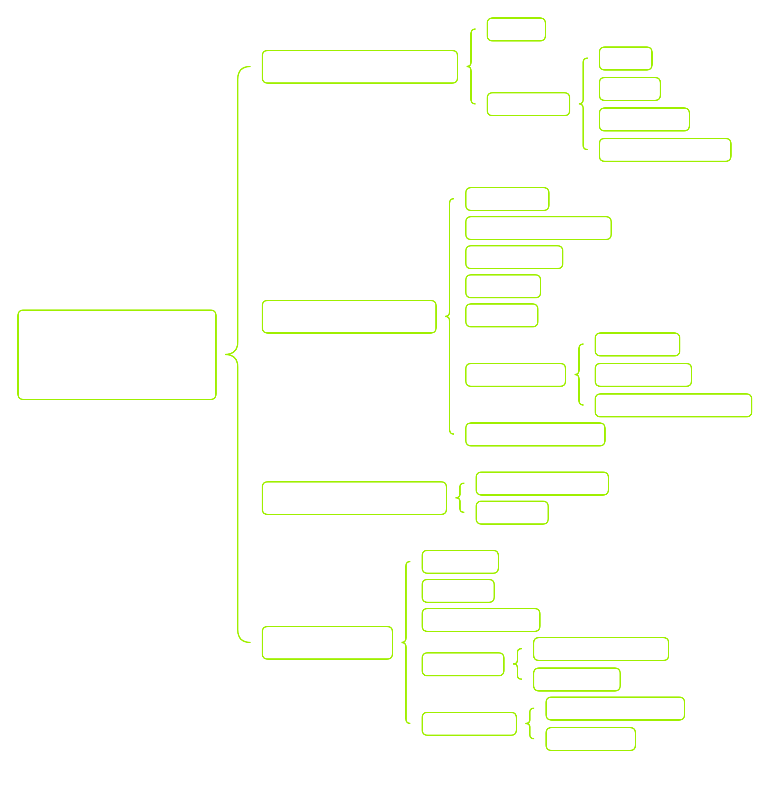

# Windows Command-Line

## CMD

`find / -name cmd.exe 2>/dev/null`:
```powershell
Get-ChildItem -Recurse C:\ -Filter cmd.exe
```


`ifconfig`:
```cmd
ipconfig /all
```

`clear`:
```cmd
cls
```

`neofetch`
```cmd
systeminfo
```

`cat ~/.bash_history`:
```
doskey /history
```

```
mkdir
dir
cd
rmdir
move
xcopy C:\Users\htb\Documents\example C:\Users\htb\Desktop\ /E /K  # deprecated, /E is to copy empty directories, /K is to preserve file attributes
robocopy C:\Users\htb\Desktop C:\Users\htb\Documents\
more
type    # cat
openfiles   # show open files. requires admin
type passwords.txt >> secrets.txt
echo Check this out > demo.txt
echo More text for our demo file >> demo.txt
ren demo.txt superdemo.txt      # rename file
find    # in CMD, find is like grep
ipconfig /all | find /i "ipv4
ping 8.8.8.8 & type test.txt    # here '&' is like ';' in UNIX
ping 8.8.8.8 && type test.txt    # here '&&' is equal to '&&' in UNIX
del  # or erase, is rm in UNIX
copy    # is like cp
move    # is like mv
whoami
```

### Gathering System Information

Below is a chart that outlines the main types of information to be aware.



---

* Obtain system information:

```
C:\htb> systeminfo

Host Name:                 DESKTOP-htb
OS Name:                   Microsoft Windows 10 Pro
OS Version:                10.0.19042 N/A Build 19042
OS Manufacturer:           Microsoft Corporation
OS Configuration:          Standalone Workstation
OS Build Type:             Multiprocessor Free

C:\htb> hostname

DESKTOP-htb

C:\htb> ver

Microsoft Windows [Version 10.0.19042.2006]
```

* Obtain network information
```
C:\htb> ipconfig

Windows IP Configuration

<SNIP>

Ethernet adapter Ethernet:

   Connection-specific DNS Suffix  . : htb.local
   Link-local IPv6 Address . . . . . : fe80::2958:39a:df51:b60%23
   IPv4 Address. . . . . . . . . . . : 10.0.25.17
   Subnet Mask . . . . . . . . . . . : 255.255.255.0
   Default Gateway . . . . . . . . . : 10.0.25.1

Ethernet adapter Ethernet 2:

   Connection-specific DNS Suffix  . : internal.htb.local
   Link-local IPv6 Address . . . . . : fe80::bc3b:6f9f:68d4:3ec5%26
   IPv4 Address. . . . . . . . . . . : 172.16.50.15
   Subnet Mask . . . . . . . . . . . : 255.255.255.0
   Default Gateway . . . . . . . . . : 172.16.50.1
```

* Find additional hosts with `arp`:
```
C:\htb> arp /a

Interface: 10.0.25.17 --- 0x17
  Internet Address      Physical Address      Type
  10.0.25.1             00-e0-67-15-cf-43     dynamic
  10.0.25.5             54-9f-35-1c-3a-e2     dynamic
  10.0.25.10            00-0c-29-62-09-81     dynamic
  10.0.25.255           ff-ff-ff-ff-ff-ff     static
  224.0.0.22            01-00-5e-00-00-16     static
  224.0.0.251           01-00-5e-00-00-fb     static
  224.0.0.252           01-00-5e-00-00-fc     static
  239.255.255.250       01-00-5e-7f-ff-fa     static
  255.255.255.255       ff-ff-ff-ff-ff-ff     static

Interface: 172.16.50.15 --- 0x1a
  Internet Address      Physical Address      Type
  172.16.50.1           15-c0-6b-58-70-ed     dynamic
  172.16.50.20          80-e5-53-3c-72-30     dynamic
  172.16.50.32          fb-90-01-5c-1f-88     dynamic
  172.16.50.65          7a-49-56-10-3b-76     dynamic
  172.16.50.255         ff-ff-ff-ff-ff-ff     static
  224.0.0.22            01-00-5e-00-00-16     static
  224.0.0.251           01-00-5e-00-00-fb     static
  224.0.0.252           01-00-5e-00-00-fc     static
  239.255.255.250       01-00-5e-7f-ff-fa     static\
```

From this example, we can see all the hosts that have come into contact or might have had some prior communication with our target. We can use this information to begin mapping the network along each of the networking interfaces belonging to our target.

* Understanding our current user
```
C:\htb> whoami

ACADEMY-WIN11\htb-student
```

As we can see from the initial output above, running whoami without parameters provides us with the current domain and the user name of the logged-in account. If the current user is not a domain-joined account, the NetBIOS name will be provided instead. The current hostname will be used in most cases.

* Checking out our privileges
```
C:\htb> whoami /priv
PRIVILEGES INFORMATION
----------------------

Privilege Name                Description                          State
============================= ==================================== ========
SeShutdownPrivilege           Shut down the system                 Disabled
SeChangeNotifyPrivilege       Bypass traverse checking             Enabled
SeUndockPrivilege             Remove computer from docking station Disabled
SeIncreaseWorkingSetPrivilege Increase a process working set       Disabled
SeTimeZonePrivilege           Change the time zone                 Disabled
```

* Investigating groups
```
C:\htb> whoami /groups

GROUP INFORMATION
-----------------

Group Name                             Type             SID          Attributes
====================================== ================ ============ ==================================================
Everyone                               Well-known group S-1-1-0      Mandatory group, Enabled by default, Enabled group
BUILTIN\Users                          Alias            S-1-5-32-545 Mandatory group, Enabled by default, Enabled group
BUILTIN\Performance Log Users          Alias            S-1-5-32-559 Mandatory group, Enabled by default, Enabled group
NT AUTHORITY\INTERACTIVE               Well-known group S-1-5-4      Mandatory group, Enabled by default, Enabled group
CONSOLE LOGON                          Well-known group S-1-2-1      Mandatory group, Enabled by default, Enabled group
NT AUTHORITY\Authenticated Users       Well-known group S-1-5-11     Mandatory group, Enabled by default, Enabled group
NT AUTHORITY\This Organization         Well-known group S-1-5-15     Mandatory group, Enabled by default, Enabled group
NT AUTHORITY\Local account             Well-known group S-1-5-113    Mandatory group, Enabled by default, Enabled group
LOCAL                                  Well-known group S-1-2-0      Mandatory group, Enabled by default, Enabled group
NT AUTHORITY\NTLM Authentication       Well-known group S-1-5-64-10  Mandatory group, Enabled by default, Enabled group
Mandatory Label\Medium Mandatory Level Label            S-1-16-8192
```

* Investigating other users/groups
```
C:\htb> net user

User accounts for \\ACADEMY-WIN11

-------------------------------------------------------------------------------
Administrator            DefaultAccount           Guest
htb-student              WDAGUtilityAccount
The command completed successfully.
```

* Net group / localgroup

Net Group will display any groups that exist on the host from which we issued the command, create and delete groups, and add or remove users from groups. It will also display domain group information if the host is joined to the domain. Keep in mind, `net group` must be run against a domain server such as the DC, while `net localgroup` can be run against any host to show us the groups it contains.

```
C:\htb> net group
net group
This command can be used only on a Windows Domain Controller.

More help is available by typing NET HELPMSG 3515.


C:\htb>net localgroup

Aliases for \\ACADEMY-WIN11

-------------------------------------------------------------------------------
*__vmware__
*Access Control Assistance Operators
*Administrators
*Backup Operators
*Cryptographic Operators
*Device Owners
*Distributed COM Users
*Event Log Readers
*Guests
*Hyper-V Administrators
*IIS_IUSRS
*Network Configuration Operators
*Performance Log Users
*Performance Monitor Users
*Power Users
*Remote Desktop Users
*Remote Management Users
*Replicator
*System Managed Accounts Group
*Users
The command completed successfully.
```

* Exploring Resources on the Network

In a domain environment, users are typically required to store any work-related material on a share located on the network versus storing files locally on their machine. These shares are usually found on a server away from the physical access of a run-of-the-mill employee. Typically, standard users will have the necessary permissions to read, write, and execute files from a share, provided they have valid credentials.

Net Share allows us to display info about shared resources on the host and to create new shared resources as well.
```
C:\htb> net share  

Share name   Resource                        Remark

-------------------------------------------------------------------------------
C$           C:\                             Default share
IPC$                                         Remote IPC
ADMIN$       C:\Windows                      Remote Admin
Records      D:\Important-Files              Mounted share for records storage  
The command completed successfully.
```

In addition to providing information, `shares` are great for hosting anything we need and laterally moving across hosts as a pentester. If we are not too worried about being sneaky, we can drop a payload or other data onto a share to enable movement around other hosts on the network. Although outside of the scope of this module, abusing shares in this manner is an excellent persistence method and can potentially be used to escalate privileges.

* Net View

**Net View** will display to us any shared resources the host you are issuing the command against knows of. This includes domain resources, shares, printers, and more.
```
C:\htb> net view
```

> Note: In a standard environment, cmd-prompt usage is not a common thing for a regular user. Administrators sometimes have a reason to use it but will be actively suspicious of any average user executing cmd.exe. With that in mind, using net * commands within an environment is not a normal thing either, and can be one way to alert on potential infiltration of a networked host easily. With proper monitoring and logging enabled, we should spot these actions quickly and use them to triage an incident before it gets too far out of hand.


### Finding Files and Directories

* Searching with CMD

```
C:\Users\student\Desktop>where calc.exe

C:\Windows\System32\calc.exe

C:\Users\student\Desktop>where bio.txt

INFO: Could not find files for the given pattern(s).
```

First, we searched for `calc.exe`. This command worked because the system32 folder is in our environment variable path, so the `where` command can look through those folders automatically.

The second attempt we see failed. This is because we are searching for a file that does not exist within that environment path. It is located within our user directory. So we need to specify the path to search in, and to ensure we dig through all directories within that path, we can use the `/R` switch.

* Recursive Where

```
C:\Users\student\Desktop>where /R C:\Users\student\ bio.txt

C:\Users\student\Downloads\bio.txt
```

* Using Wildcards

Above, we searched recursively, looking for `bio.txt`. The file was found in the `C:\Users\student\Downloads\` folder. The `/R` switch forced the where command to search through every folder in the student user directory hive. On top of looking for files, we can also search wildcards for specific strings, file types, and more. Below is an example of searching for the csv file type within the student directory.

```
C:\Users\student\Desktop>where /R C:\Users\student\ *.csv

C:\Users\student\AppData\Local\live-hosts.csv
```

* Basic Find

```
C:\Users\student\Desktop> find "password" "C:\Users\student\not-passwords.txt" 
```

* Find Modifiers

We can modify the way `find` searches using several switches. The `/V` modifier can change our search from a matching clause to a `Not` clause. So, for example, if we use `/V` with the search string password against a file, it will show us any line that does not have the specified string. We can also use the `/N` switch to display line numbers for us and the `/I` display to ignore case sensitivity. In the example below, we use all of the modifiers to show us any lines that do not match the string **IP Address** while asking it to display line numbers and ignore the case of the string.

* Findstr

For quick searches, `find` is easy to use, but it could be more robust in how it can search. However, if we need something more specific, `findstr` is what we need. The `findstr` command is similar to `find` in that it searches through files but for patterns instead. It will look for anything matching a pattern, regex value, wildcards, and more. Think of it as find2.0. For those familiar with Linux, `findstr` is closer to `grep`.
```
C:\Users\student\Desktop> findstr
```

#### Evaluating and Sorting Files

* Compare

`Comp` will check each byte within two files looking for differences and then displays where they start. By default, the differences are shown in a decimal format. We can use the `/A` modifier if we want to see the differences in ASCII format. The `/L` modifier can also provide us with the line numbers.
```
C:\Users\student\Desktop> comp .\file-1.md .\file-2.md

Comparing .\file-1.md and .\file-2.md...
Files compare OK  
```

* FC

**FC** differs in that it will show you which lines are different, not just an individual character (`/A`) or byte that is different on each line. FC has quite a few more options than Comp has, so be sure to look at the help output to ensure you are using it in the manner you want.

```
C:\Users\student\Desktop> fc passwords.txt modded.txt /N

Comparing files passwords.txt and MODDED.TXT
***** passwords.txt
    1:  123456
    2:  password
***** MODDED.TXT
    1:  123456
    2:
    3:  password
*****

***** passwords.txt
    5:  12345
    6:  qwerty
***** MODDED.TXT
    6:  12345
    7:  Just something extra to show functionality. Did it see the space inserted above?
    8:  qwerty
*****

```

The output from FC is much easier to interpret and gives us a bit more clarity about the differences between the files.

* Sort

With **Sort**, we can receive input from the console, pipeline, or a file, sort it and send the results to the console or into a file or another command. It is relatively simple to use and often will be used in conjunction with pipeline operators such as `|`, `<`, and `>`.
```
C:\Users\student\Desktop> type .\file-1.md
a
b
d
h
w
a
q
h
g

C:\Users\MTanaka\Desktop> sort.exe .\file-1.md /O .\sort-1.md
C:\Users\MTanaka\Desktop> type .\sort-1.md

a
a
b
d
g
h
h
q
w
```

We could also use the `/unique` modifier to only display unique lines in sorted order.
```
C:\htb> type .\sort-1.md

a
a
b
d
g
h
h
q
w

PS C:\Users\MTanaka\Desktop> sort.exe .\sort-1.md /unique

a
b
d
g
h
q
w  
```

### Environment Variables

Environment variables on Windows are called like so:
```
%SUPER_IMPORTANT_VARIABLE%
```
<++>
